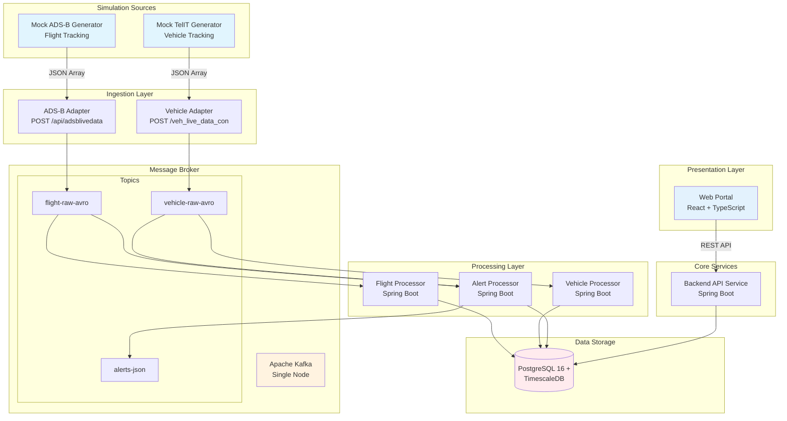

<!--
Sync Impact Report:
- Version change: 1.0.0 -> 1.1.0 (Architecture Visualization)
- Modified principles: None.
- Added sections: Architecture Diagram (Visualized MVP Scope).
- Removed sections: None.
- Templates requiring updates: None.
- Follow-up TODOs: None.
-->
# Unified Total Airside Management (UTAM) MVP Constitution

## Core Principles

### I. Simplicity First (MVP Focus)

Focus strictly on MVP scope: Live Flight Tracking, Live Vehicle Tracking, Basic Alerting, and Simple Dashboard. Avoid over-engineering; specifically, NO Kubernetes for this phase. Stick to the defined scope to ensure rapid delivery of the proof-of-concept.

### II. Containerization & Local Dev

All components MUST run in Docker containers. The development environment MUST be fully local and reproducible via `docker-compose up`. No cloud dependencies should be required for the core MVP functionality.

### III. Simulation Driven

Since this is a POC, the system MUST rely on mock data generators for ADSB (Flight) and TelIT (Vehicle) data. The system must be able to ingest and process these simulated streams effectively as if they were live data.

### IV. Tech Stack Compliance

Strict adherence to the defined stack:

- Backend: Spring Boot 3.x (Java 17+)
- Frontend: React 18+ with TypeScript
- Message Broker: Apache Kafka (single node)
- Database: PostgreSQL 16+ with TimescaleDB extension

### V. Documentation & Clean Code

Maintain clear documentation for setup, architecture, and API contracts. Follow standard coding conventions for Java and TypeScript. Code should be self-documenting where possible, with comments explaining "why" rather than "what".

## Architecture & Constraints

### Architecture

- **Microservices**: Even for MVP, separate concerns (e.g., Ingestion, Processing, Web).
- **Event-Driven**: Communication via Kafka for real-time data updates.
- **REST API**: For frontend-backend interaction and configuration.
- **Time-Series Storage**: Use TimescaleDB for efficient storage of tracking data.

### Interface Specifications (ICD Alignment)

To ensure future extendibility, the MVP components must adhere to the interfaces defined in `Azure UTAM DIAL ICD Ver 1.0`.

#### 1. Flight Data (ADS-B)

- **Source**: Mock Generator (simulating ADS-B feed).
- **Endpoint**: `POST /api/adsblivedata`
- **Format**: JSON Array of Objects.
- **Key Fields**: `LivePlotId`, `TrackId`, `Time` (Unix), `Latitude`, `Longitude`, `Speed`, `Heading`, `FlightLevel`, `Callsign`, `FlightNumber`, `AcType`, `FlightStatus`.

#### 2. Vehicle Data (TelIT)

- **Source**: Mock Generator (simulating TelIT feed).
- **Endpoint**: `POST /veh_live_data_con`
- **Format**: JSON Array of Objects.
- **Key Fields**: `Vehicle_Name`, `Vehicle_No`, `Latitude`, `Longitude`, `Speed`, `Angle`, `Status` (STOP/RUNNING/IDLE), `Vehicletype`, `GPSActualTime`, `IGN`, `Power`.

#### 3. Alerting (Functional Requirement)

- **Scope**: Vehicle Speed Violations (as per MVP).
- **Logic**: Trigger alert when `Speed` > Limit (configurable).
- **Output**: Alert event with `Timestamp`, `VehicleNo`, `Speed`, `Location`.

### Constraints

- **Performance**: System must handle the simulated load of flights and vehicles without significant lag.
- **Security**: Basic security practices (no hardcoded secrets), but advanced auth is not a priority for MVP unless specified.

## Development Workflow

### Workflow

- **Feature Branches**: All work done in feature branches.
- **Local Testing**: Verify functionality locally using Docker Compose before merging.
- **Build Verification**: Ensure `docker-compose build` passes.
- **Code Review**: Peer review required for all changes, checking against these principles.

## Governance

### Amendment Procedure

Amendments to this constitution require team agreement. Changes must be documented in the Sync Impact Report of the update.

### Versioning Policy

This constitution follows Semantic Versioning (MAJOR.MINOR.PATCH).

- MAJOR: Backward incompatible governance/principle removals or redefinitions.
- MINOR: New principle/section added or materially expanded guidance.
- PATCH: Clarifications, wording, typo fixes.

### Compliance

All Pull Requests and design reviews MUST verify compliance with these principles. Complexity must be justified.

**Version**: 1.1.0 | **Ratified**: 2025-12-07 | **Last Amended**: 2025-12-07
