# TAM Platform Architecture - C4 Model Documentation

## Introduction to C4 Model

The C4 model is a hierarchical approach to software architecture documentation that provides different levels of abstraction:

1. **Level 1: System Context** - High-level view of the entire system
2. **Level 2: Containers** - Major application components and their interactions
3. **Level 3: Components** - Internal structure of each container
4. **Level 4: Code** - Detailed implementation of individual components

## Level 1: System Context Diagram

### Overview

The TAM platform operates within an airport operational environment, integrating with various external systems and serving multiple user types.

### Context Diagram

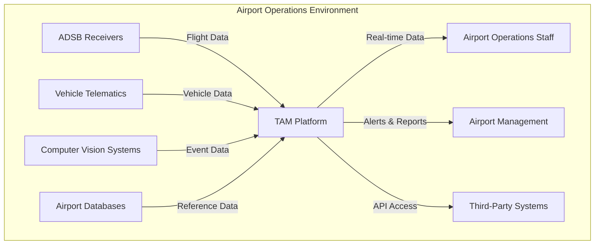

### Key External Entities

1. **Airport Operations Staff**: Primary users who monitor real-time operations
2. **Airport Management**: Consumers of reports and analytics
3. **Third-Party Systems**: External applications integrating with TAM
4. **ADSB Receivers**: Source of flight position data
5. **Vehicle Telematics**: Source of ground vehicle tracking data
6. **Computer Vision Systems**: Source of operational event detection
7. **Airport Databases**: Reference data for flights, vehicles, and operations

### System Responsibilities

- Real-time tracking of flights and ground vehicles
- Speed violation detection and alert generation
- Turnaround operation monitoring and management
- Data visualization and reporting
- Multi-tenancy support for different airport operators

## Level 2: Container Diagram

### Container Overview

The TAM platform consists of several major containers that work together to provide the complete functionality.

### Container Diagram

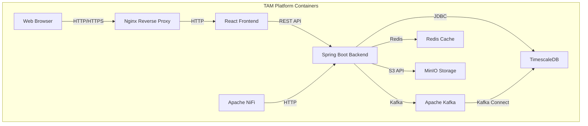

### Container Descriptions

#### 1. Web Browser
- **Technology**: Modern browsers (Chrome, Firefox, Safari)
- **Responsibility**: Render the user interface and handle user interactions
- **Protocols**: HTTP/HTTPS, WebSocket

#### 2. Nginx Reverse Proxy
- **Technology**: Nginx 1.25+
- **Responsibility**: Load balancing, SSL termination, request routing
- **Protocols**: HTTP/HTTPS

#### 3. React Frontend
- **Technology**: React 18, TypeScript, Vite
- **Responsibility**: User interface rendering, state management, API communication
- **Protocols**: HTTP/HTTPS, WebSocket
- **Key Components**: Map visualization, dashboards, forms, real-time updates

#### 4. Spring Boot Backend
- **Technology**: Java 21, Spring Boot 3.4.12
- **Responsibility**: Business logic, data processing, API endpoints
- **Protocols**: HTTP/HTTPS, Kafka, JDBC, Redis
- **Key Components**: Controllers, Services, Repositories, Kafka Consumers

#### 5. TimescaleDB
- **Technology**: PostgreSQL 15 + TimescaleDB extension
- **Responsibility**: Persistent data storage, time-series data management
- **Protocols**: JDBC, PostgreSQL wire protocol
- **Key Features**: Hypertables, continuous aggregates, compression

#### 6. Apache Kafka
- **Technology**: Kafka 3.x / Redpanda
- **Responsibility**: Event streaming, data pipeline backbone
- **Protocols**: Kafka protocol
- **Key Topics**: flight-raw-json, vehicle-raw-json, turnaround-raw-json

#### 7. Apache NiFi
- **Technology**: NiFi 1.20+
- **Responsibility**: Data ingestion, transformation, routing
- **Protocols**: HTTP, Kafka
- **Key Features**: Process groups, processors, data provenance

#### 8. Redis Cache
- **Technology**: Redis 7.x
- **Responsibility**: Caching, session management, temporary data storage
- **Protocols**: Redis protocol

#### 9. MinIO Storage
- **Technology**: MinIO (S3-compatible)
- **Responsibility**: Object storage for files, images, and large data
- **Protocols**: S3 API

### Container Interactions

1. **User Request Flow**:
   - Browser → Nginx → React Frontend → Spring Boot Backend → TimescaleDB

2. **Data Ingestion Flow**:
   - External Systems → NiFi → Kafka → Spring Boot Backend → TimescaleDB

3. **Real-time Updates**:
   - Spring Boot Backend → WebSocket → React Frontend → Browser

4. **Caching**:
   - Spring Boot Backend ↔ Redis (for frequently accessed data)

5. **File Storage**:
   - Spring Boot Backend ↔ MinIO (for large files and assets)

## Level 3: Component Diagrams

### 3.1 Frontend Container Components

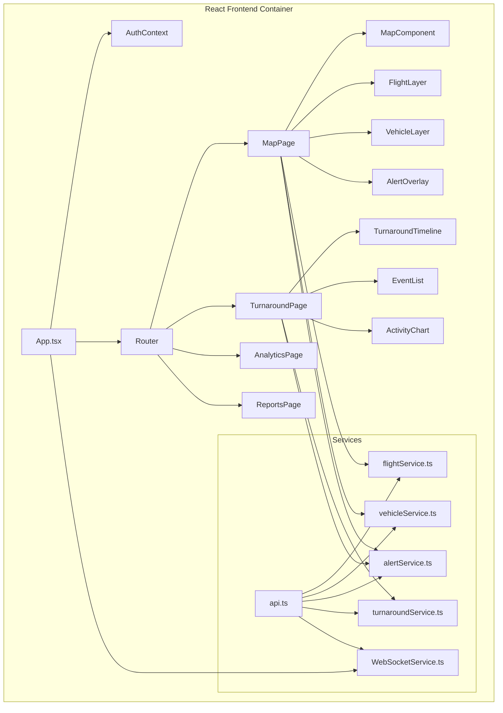

#### Frontend Component Descriptions

1. **App.tsx**: Main application entry point
2. **AuthContext**: Authentication state management
3. **Router**: Page navigation and routing
4. **MapPage**: Real-time map visualization
5. **TurnaroundPage**: Turnaround operation monitoring
6. **AnalyticsPage**: Operational analytics dashboard
7. **ReportsPage**: Reporting interface

**Map Components**:
- **MapComponent**: Leaflet map initialization
- **FlightLayer**: Flight position rendering
- **VehicleLayer**: Vehicle position rendering
- **AlertOverlay**: Alert visualization

**Turnaround Components**:
- **TurnaroundTimeline**: Operational timeline
- **EventList**: Event listing and filtering
- **ActivityChart**: Activity visualization

**Services**:
- **api.ts**: Base API configuration
- **flightService.ts**: Flight data operations
- **vehicleService.ts**: Vehicle data operations
- **alertService.ts**: Alert management
- **turnaroundService.ts**: Turnaround operations
- **WebSocketService.ts**: Real-time updates

### 3.2 Backend Container Components

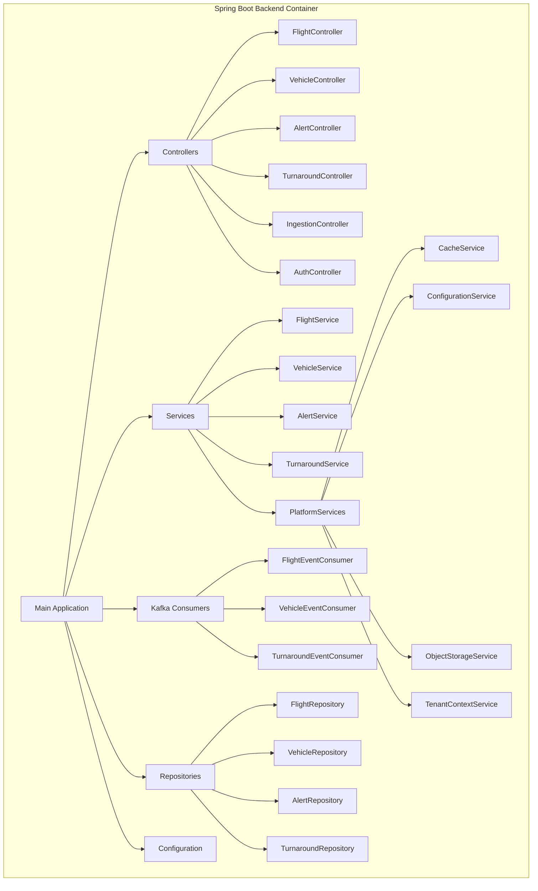

#### Backend Component Descriptions

1. **Controllers**: REST API endpoints
   - **FlightController**: Flight data operations
   - **VehicleController**: Vehicle data operations
   - **AlertController**: Alert management
   - **TurnaroundController**: Turnaround operations
   - **IngestionController**: Data ingestion endpoints
   - **AuthController**: Authentication operations

2. **Services**: Business logic
   - **FlightService**: Flight business logic
   - **VehicleService**: Vehicle business logic
   - **AlertService**: Alert generation and management
   - **TurnaroundService**: Turnaround workflow management

3. **Platform Services**: Infrastructure services
   - **CacheService**: Redis-based caching
   - **ConfigurationService**: Dynamic configuration
   - **ObjectStorageService**: MinIO integration
   - **TenantContextService**: Multi-tenancy support

4. **Kafka Consumers**: Event processing
   - **FlightEventConsumer**: Flight data processing
   - **VehicleEventConsumer**: Vehicle data processing
   - **TurnaroundEventConsumer**: Turnaround event processing

5. **Repositories**: Data access
   - **FlightRepository**: Flight data persistence
   - **VehicleRepository**: Vehicle data persistence
   - **AlertRepository**: Alert data persistence
   - **TurnaroundRepository**: Turnaround data persistence

### 3.3 Infrastructure Container Components

#### Apache NiFi Components

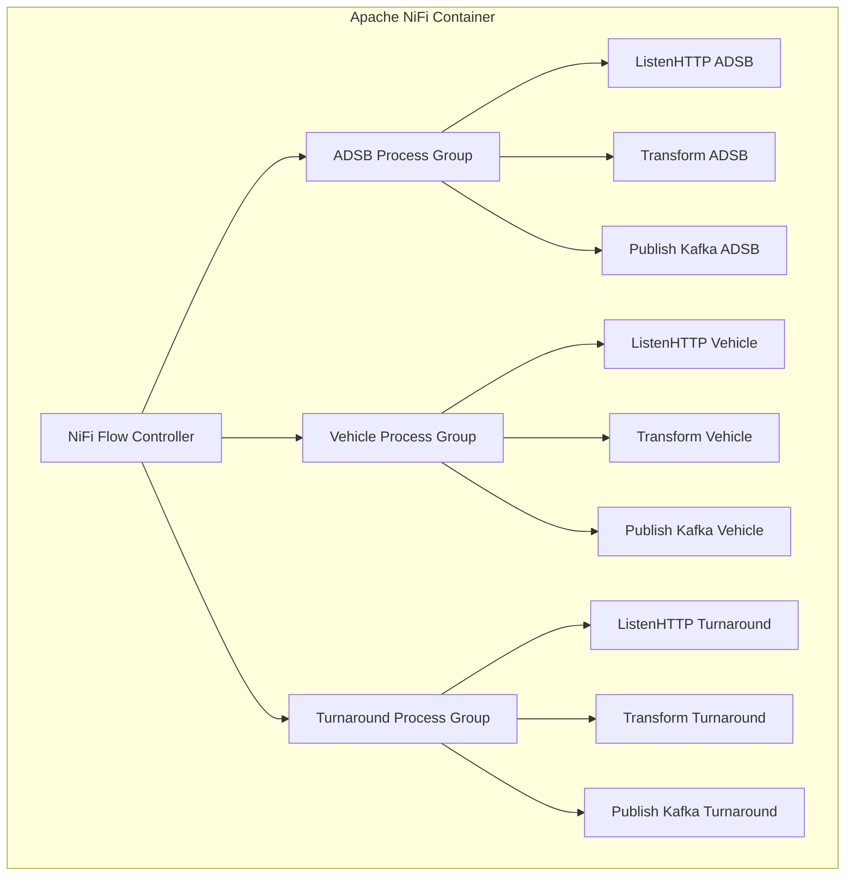

#### Kafka Components

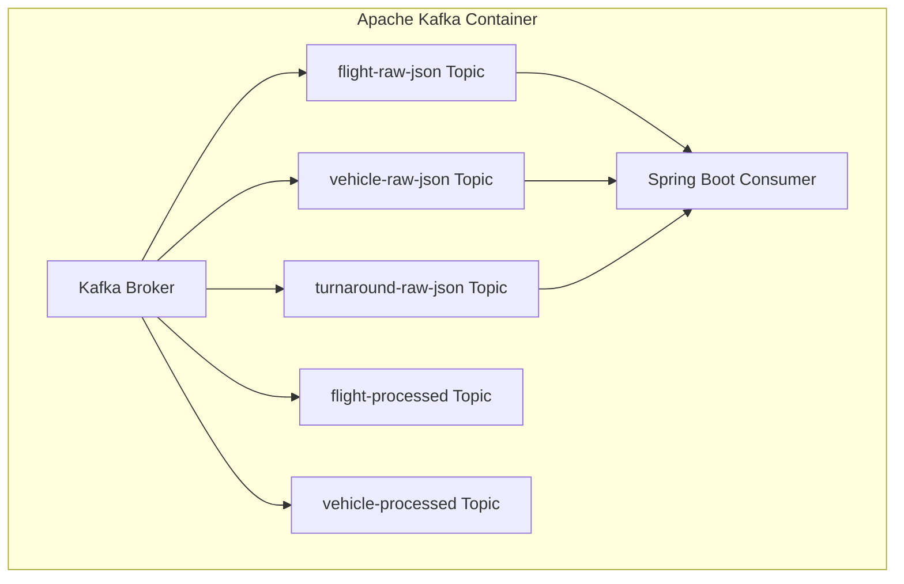

## Level 4: Code Diagrams

### 4.1 Flight Processing Component

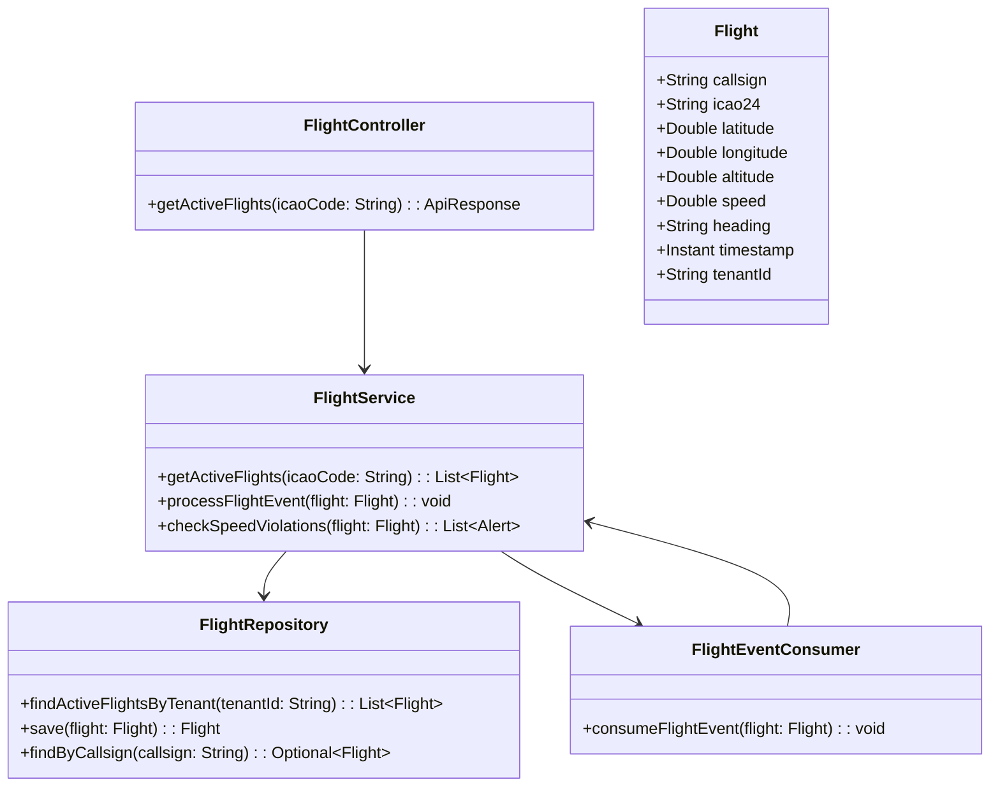

### 4.2 Vehicle Processing Component

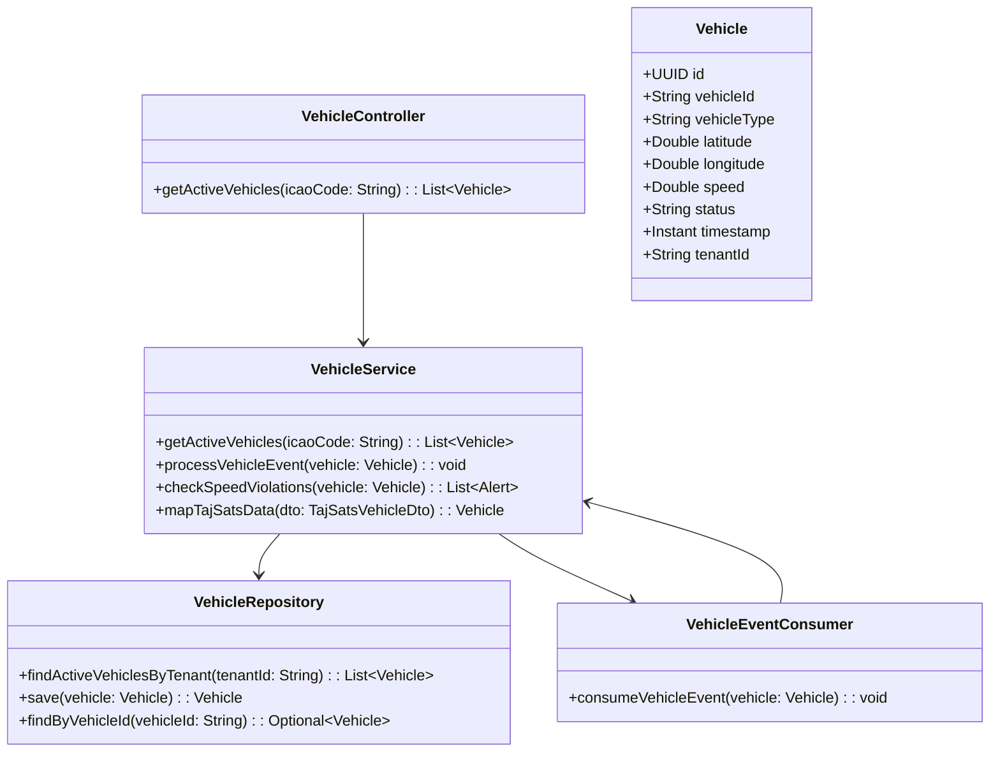

### 4.3 Turnaround Processing Component

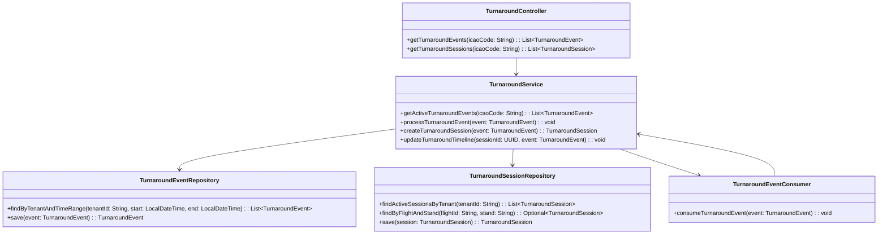

### 4.4 Platform Services Component

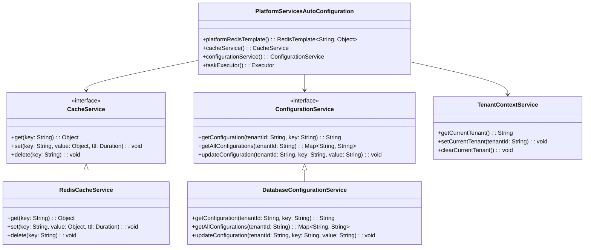

## Deployment Architecture

### Production Deployment Diagram

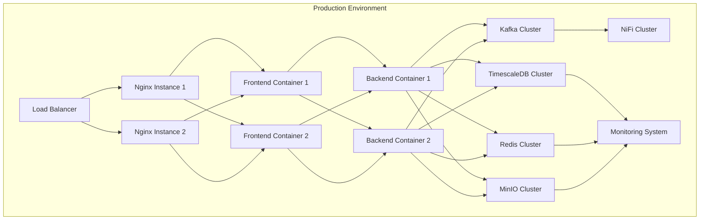

### Development Environment Diagram

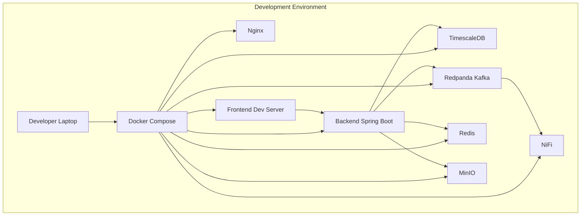

## Data Flow Diagrams

### 1. Flight Data Flow

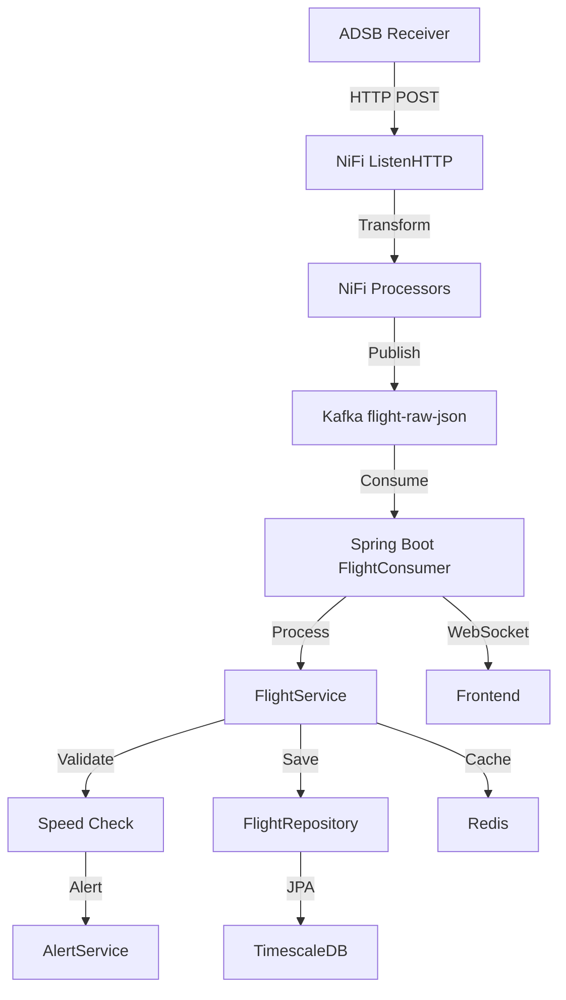

### 2. Vehicle Data Flow

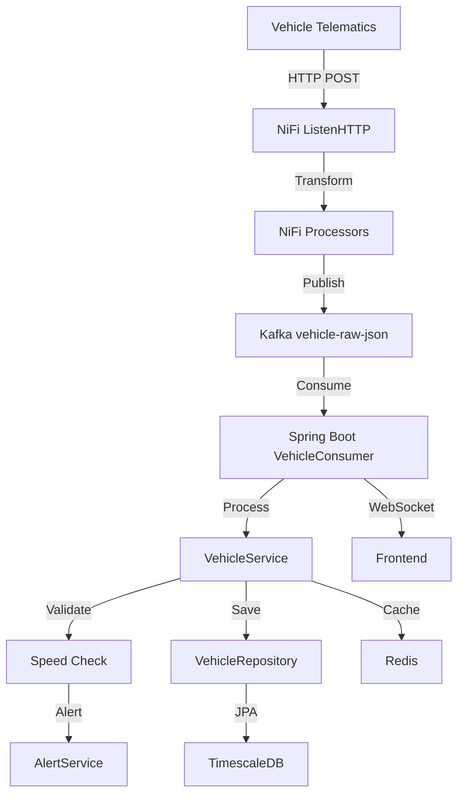

### 3. Turnaround Event Flow

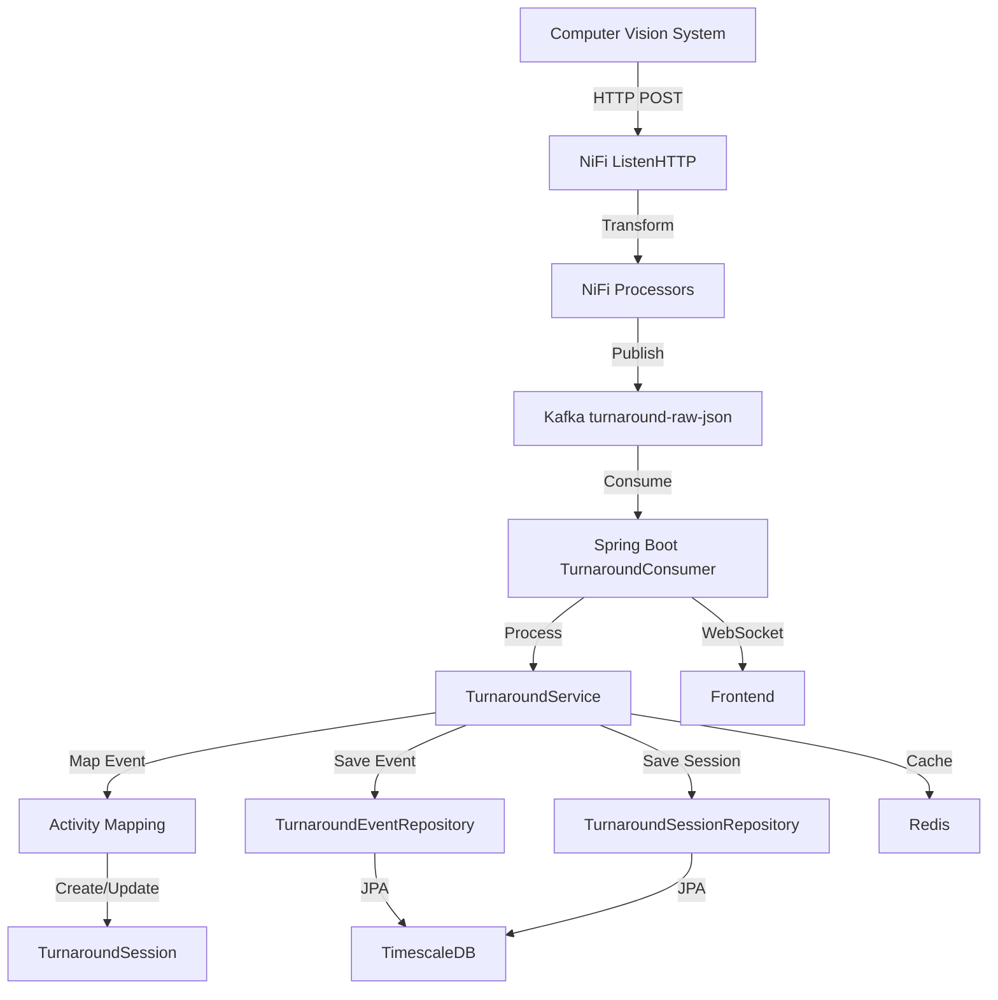

## Technology Stack Details

### Frontend Technology Stack

| Component | Technology | Version | Purpose |
|-----------|------------|---------|---------|
| Framework | React | 18.x | UI Component Library |
| Language | TypeScript | 5.x | Type-safe JavaScript |
| Build Tool | Vite | 4.x | Fast development server |
| Styling | Tailwind CSS | 3.x | Utility-first CSS |
| Maps | Leaflet | 1.x | Interactive maps |
| HTTP Client | Axios | 1.x | API communication |
| State Management | React Context | - | Global state |
| Routing | React Router | 6.x | Page navigation |

### Backend Technology Stack

| Component | Technology | Version | Purpose |
|-----------|------------|---------|---------|
| Framework | Spring Boot | 3.4.12 | Application framework |
| Language | Java | 21 | Programming language |
| ORM | Spring Data JPA | 3.x | Database access |
| Messaging | Spring Kafka | 3.x | Event streaming |
| Security | Spring Security | 6.x | Authentication/Authorization |
| Caching | Spring Cache | - | Caching abstraction |
| Configuration | Spring Cloud Config | - | External configuration |

### Infrastructure Technology Stack

| Component | Technology | Version | Purpose |
|-----------|------------|---------|---------|
| Database | TimescaleDB | 2.x | Time-series database |
| Streaming | Apache Kafka | 3.x | Event streaming |
| Ingestion | Apache NiFi | 1.20+ | Data pipeline |
| Cache | Redis | 7.x | In-memory cache |
| Storage | MinIO | Latest | Object storage |
| Containerization | Docker | 20.x | Container runtime |
| Orchestration | Docker Compose | 2.x | Multi-container management |
| Reverse Proxy | Nginx | 1.25+ | Load balancing |

## Key Architectural Decisions

### 1. Event-Driven Architecture

**Decision**: Use Kafka as the central event bus for all data processing

**Rationale**:
- Decouples data producers and consumers
- Enables scalable processing
- Provides fault tolerance and replay capability
- Supports multiple consumers for different processing needs

**Impact**:
- All data flows through Kafka topics
- Services can process events independently
- Easy to add new consumers without affecting producers

### 2. Multi-tenancy Implementation

**Decision**: Implement multi-tenancy at the application level with tenant context

**Rationale**:
- Simpler than database-level multi-tenancy
- More flexible for tenant-specific business logic
- Easier to implement and maintain
- Can be extended to database-level if needed

**Impact**:
- Tenant ID propagated through all service calls
- Data filtered by tenant in repositories
- Tenant-specific configuration support

### 3. Real-time Updates

**Decision**: Use WebSocket for real-time frontend updates

**Rationale**:
- Low latency updates
- Efficient compared to polling
- Built-in reconnection handling
- Scales well with multiple clients

**Impact**:
- Frontend receives immediate updates
- Reduced server load compared to polling
- Better user experience

### 4. Data Simulation

**Decision**: Include built-in data simulators in the backend

**Rationale**:
- Enables development without real data sources
- Useful for testing and demonstrations
- Can be disabled in production
- Provides realistic data patterns

**Impact**:
- Easier development and testing
- Self-contained demonstration capability
- Realistic load testing

## Performance Considerations

### 1. Database Optimization

- **Hypertables**: TimescaleDB hypertables for time-series data
- **Indexing**: Proper indexing on frequently queried columns
- **Query Optimization**: Optimized JPA queries with projections
- **Caching**: Redis caching for frequently accessed data

### 2. Event Processing

- **Consumer Groups**: Multiple Kafka consumers for parallel processing
- **Batch Processing**: Batch processing of events where possible
- **Backpressure Handling**: Proper backpressure management
- **Error Handling**: Robust error handling and retry mechanisms

### 3. Frontend Performance

- **Virtualization**: Virtualized lists for large datasets
- **Memoization**: React.memo for component optimization
- **Lazy Loading**: Code splitting and lazy loading
- **Debouncing**: Debounced API calls for user inputs

## Security Architecture

### 1. Authentication

- **JWT Tokens**: JSON Web Tokens for stateless authentication
- **Spring Security**: Comprehensive security framework
- **Role-Based Access**: Fine-grained permission control

### 2. Authorization

- **Tenant Isolation**: Data access restricted by tenant
- **Role-Based Access Control**: Different access levels
- **API Security**: Secured REST endpoints

### 3. Data Protection

- **HTTPS**: Encrypted communication
- **Input Validation**: Protection against injection attacks
- **Secure Headers**: Security headers for web applications

## Monitoring and Observability

### 1. Logging

- **Structured Logging**: JSON-formatted logs
- **Log Levels**: Appropriate log level usage
- **Log Correlation**: Correlation IDs for request tracing

### 2. Metrics

- **Prometheus**: Metrics collection
- **Grafana**: Visualization dashboards
- **Custom Metrics**: Business-specific metrics

### 3. Tracing

- **Distributed Tracing**: Request tracing across services
- **Performance Monitoring**: Response time monitoring
- **Error Tracking**: Exception tracking and alerting

## Scalability Strategy

### 1. Horizontal Scaling

- **Stateless Services**: Easy to scale frontend and backend
- **Containerization**: Docker-based deployment
- **Load Balancing**: Nginx-based load distribution

### 2. Database Scaling

- **Read Replicas**: For read-heavy workloads
- **Connection Pooling**: Efficient database connections
- **Caching**: Redis caching for frequent queries

### 3. Event Processing Scaling

- **Consumer Groups**: Parallel Kafka consumers
- **Partitioning**: Data partitioning for scalability
- **Batch Processing**: Efficient event processing

## Disaster Recovery

### 1. Data Backup

- **Database Backups**: Regular TimescaleDB backups
- **Configuration Backups**: NiFi flow backups
- **Code Repository**: Git-based version control

### 2. High Availability

- **Clustered Services**: Kafka, TimescaleDB, Redis clusters
- **Redundancy**: Multiple instances of critical services
- **Failover**: Automatic failover mechanisms

### 3. Recovery Procedures

- **Documented Processes**: Clear recovery procedures
- **Regular Testing**: Disaster recovery drills
- **Monitoring**: Proactive issue detection

## Conclusion

The TAM platform architecture follows modern software engineering principles with a clear separation of concerns, event-driven design, and scalable components. The C4 model provides a comprehensive view of the system at different levels of abstraction, from the high-level context to detailed code implementation.

Key architectural strengths include:

1. **Modular Design**: Clear component boundaries and responsibilities
2. **Event-Driven**: Scalable and decoupled event processing
3. **Real-time Capabilities**: WebSocket-based updates and Kafka streaming
4. **Multi-tenancy**: Enterprise-grade tenant isolation
5. **Observability**: Comprehensive monitoring and logging
6. **Resilience**: Fault-tolerant design with proper error handling

The architecture is well-positioned for future growth and can accommodate additional features and increased load through its scalable design patterns.