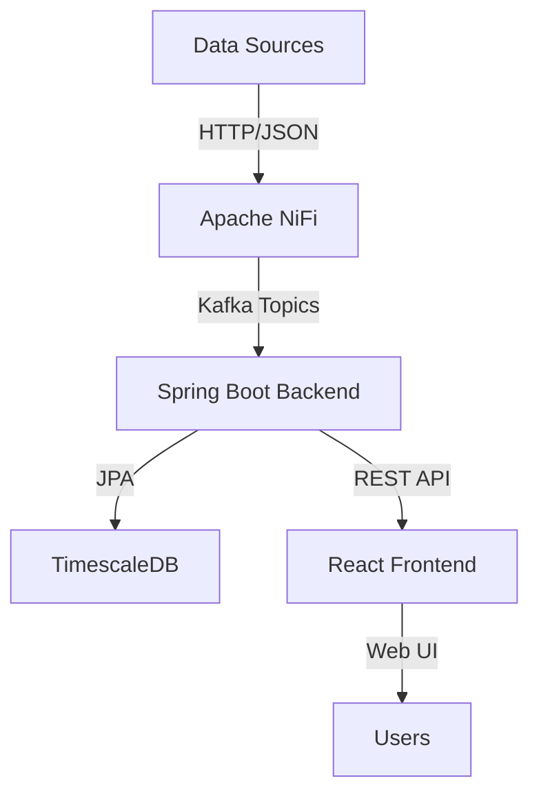

# TAM Platform Codebase Analysis

## Overview

The **TAM (Unified Tracking and Alerting Module)** platform is a comprehensive real-time tracking and alerting system designed for airport operations. It provides real-time monitoring of flights, ground vehicles, and turnaround operations with speed violation detection and operational alerts.

## Architecture Overview

The system follows a **modern microservices architecture** with the following key components:

### 1. Data Flow Architecture



### 2. Technology Stack

#### Backend
- **Java 21** with **Spring Boot 3.4.12**
- **Spring Kafka** for event streaming
- **Spring Data JPA** for database operations
- **Spring Security** for authentication
- **Redis** for caching
- **MinIO** for object storage

#### Frontend
- **React 18** with **TypeScript**
- **Vite** as build tool
- **Leaflet** for interactive maps
- **Tailwind CSS** for styling
- **Axios** for API communication

#### Infrastructure
- **Apache NiFi** for data ingestion
- **Apache Kafka** for event streaming
- **TimescaleDB** (PostgreSQL extension) for time-series data
- **Redpanda** as Kafka alternative
- **Docker Compose** for container orchestration

## Core Components Analysis

### 1. Backend Services

#### API Controllers

The backend exposes several REST endpoints:

- **FlightController** (`/api/flights`): Retrieves active flight data
- **VehicleController** (`/api/vehicles`): Retrieves ground vehicle data
- **AlertController** (`/api/alerts`): Retrieves operational alerts
- **IngestionController**: Handles data ingestion from external sources
- **TurnaroundController**: Manages turnaround operations
- **AuthController**: Handles authentication

#### Data Ingestion

The system supports multiple data ingestion methods:

1. **ADSB Flight Data**: Real-time flight position data
2. **Vehicle Telemetry**: Ground vehicle tracking data
3. **TAjSats Integration**: Third-party vehicle tracking system
4. **Computer Vision Events**: AI-based event detection

#### Platform Services Layer

The `platform-core` module provides reusable infrastructure services:

- **CacheService**: Redis-based caching
- **ConfigurationService**: Tenant-specific configuration
- **ObjectStorageService**: MinIO integration
- **TenantContextService**: Multi-tenancy support
- **DatabaseConfigurationService**: Dynamic configuration management

### 2. Frontend Components

#### Main Pages

- **MapPage**: Real-time map visualization of flights and vehicles
- **TurnaroundPage**: Turnaround operation monitoring
- **AnalyticsPage**: Operational analytics dashboard
- **ReportsPage**: Reporting interface
- **PipelinePage**: Data pipeline monitoring
- **PlatformAdminPage**: Administration interface

#### Services

- **flightService**: Flight data retrieval
- **vehicleService**: Vehicle data retrieval
- **alertService**: Alert management
- **turnaroundService**: Turnaround operations
- **WebSocketService**: Real-time updates

### 3. Infrastructure Components

#### Data Pipeline

1. **Apache NiFi**: Data ingestion and transformation
2. **Kafka Topics**: Event streaming backbone
   - `flight-raw-json`: Raw flight data
   - `vehicle-raw-json`: Raw vehicle data
   - `turnaround-raw-json`: Turnaround events
3. **TimescaleDB**: Time-series data storage with hypertables

#### Containerization

- **Docker Compose**: Multi-container orchestration
- **Nginx**: Reverse proxy and load balancing
- **Redpanda**: Kafka-compatible streaming platform

## Key Features

### 1. Real-time Tracking

- **Flight Tracking**: ADSB-based aircraft positioning
- **Vehicle Tracking**: Ground vehicle monitoring
- **Speed Violation Detection**: Automatic alert generation

### 2. Turnaround Management

- **Event Detection**: Computer vision-based activity recognition
- **Timeline Visualization**: Operational workflow tracking
- **Alert System**: Exception handling and notifications

### 3. Multi-tenancy Support

- **Tenant Isolation**: Data separation by ICAO codes
- **Dynamic Configuration**: Tenant-specific settings
- **Context Propagation**: Request-level tenant context

### 4. Data Simulation

The system includes built-in data simulators:

- **MockAdsbGenerator**: Simulates flight data every 2 seconds
- **MockTelitGenerator**: Simulates vehicle data every 2 seconds
- **Computer Vision Event Generator**: Simulates CV events every 5 seconds

## Technical Implementation Details

### 1. Backend Implementation

#### Spring Boot Configuration

- **application.yml**: Central configuration file
- **Kafka Consumer**: Event-driven processing
- **JPA Entities**: Database schema mapping
- **Repository Pattern**: Data access layer

#### Key Classes

- **FlightService**: Business logic for flight operations
- **VehicleService**: Business logic for vehicle operations
- **AlertService**: Alert generation and management
- **TurnaroundService**: Turnaround workflow management

### 2. Frontend Implementation

#### React Architecture

- **Functional Components**: Modern React patterns
- **TypeScript**: Type-safe development
- **Context API**: State management
- **Custom Hooks**: Reusable logic encapsulation

#### UI Components

- **Leaflet Maps**: Interactive geographical visualization
- **Tailwind CSS**: Utility-first styling
- **Custom Components**: Reusable UI elements

### 3. Infrastructure Implementation

#### NiFi Configuration

- **Process Groups**: Organized data flows
- **ListenHTTP Processors**: Data ingestion endpoints
- **PublishKafka Processors**: Event publishing

#### Database Schema

- **Hypertables**: Time-series data optimization
- **Multi-tenant Design**: Schema separation
- **JPA Entities**: ORM mapping

## Development Workflow

### 1. Local Development

```bash
# Start infrastructure
docker-compose -f docker-compose.dev.yml up -d

# Configure NiFi
make setup-nifi

# Run backend
cd backend
mvn spring-boot:run

# Run frontend
cd frontend
npm run dev
```

### 2. Production Deployment

```bash
# Build and deploy
docker-compose up --build -d
```

### 3. Data Simulation

The backend includes automatic data generators that simulate:

- **Flight Data**: Every 2 seconds
- **Vehicle Data**: Every 2 seconds
- **CV Events**: Every 5 seconds

## Key Technical Challenges

### 1. Real-time Data Processing

- **Challenge**: High-volume event streaming
- **Solution**: Kafka-based event-driven architecture

### 2. Multi-tenancy

- **Challenge**: Data isolation and context management
- **Solution**: Tenant context propagation and schema design

### 3. Geospatial Operations

- **Challenge**: Efficient spatial queries
- **Solution**: TimescaleDB with PostGIS extensions

### 4. System Integration

- **Challenge**: Multiple data source integration
- **Solution**: NiFi-based ingestion pipeline

## Future Enhancements

### 1. Scalability Improvements

- **Kubernetes Orchestration**: Container scaling
- **Horizontal Pod Autoscaling**: Dynamic resource allocation
- **Sharding**: Database partitioning

### 2. Advanced Analytics

- **Machine Learning**: Predictive analytics
- **Anomaly Detection**: AI-based pattern recognition
- **Historical Analysis**: Trend analysis

### 3. Enhanced UI/UX

- **3D Visualization**: Advanced map rendering
- **Mobile Support**: Responsive design
- **Custom Dashboards**: User-configurable views

## Conclusion

The TAM platform represents a sophisticated real-time tracking and alerting system for airport operations. Its modular architecture, event-driven design, and comprehensive feature set make it suitable for complex operational environments. The codebase demonstrates modern software engineering practices including:

- **Microservices Architecture**: Clear separation of concerns
- **Event-Driven Design**: Scalable data processing
- **Multi-tenancy Support**: Enterprise-grade isolation
- **Real-time Capabilities**: Low-latency operations
- **Comprehensive Monitoring**: Operational visibility

The platform is well-positioned for extension and enhancement to meet evolving airport operational requirements.