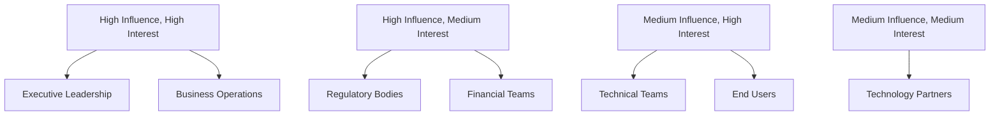
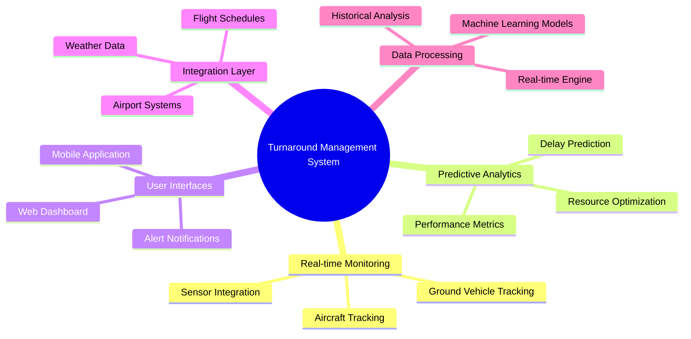
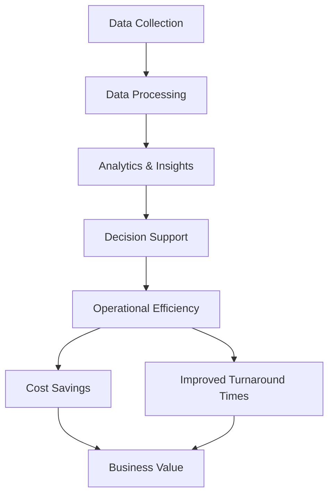

# TOGAF Architecture Vision (Phase A)

## Stakeholder Map Matrix

### Key Stakeholders

| Stakeholder Category | Specific Stakeholders | Role | Influence | Interest |
|----------------------|-----------------------|------|-----------|----------|
| Executive Leadership | CEO, CTO, CIO | Strategic Decision Making | High | High |
| Business Operations | Airport Operations Manager, Ground Services Director | Operational Oversight | High | High |
| Technical Teams | Software Architects, Developers, DevOps | System Implementation | Medium | High |
| End Users | Airline Staff, Ground Crew, Maintenance Teams | System Users | Low | High |
| Regulatory Bodies | FAA, ICAO, Local Aviation Authorities | Compliance & Standards | High | Medium |
| Technology Partners | Cloud Providers, Hardware Vendors | Infrastructure Support | Medium | Medium |
| Financial Teams | CFO, Budget Managers | Funding & ROI Analysis | High | Medium |

### Stakeholder Influence vs Interest Matrix

## Requirements Catalog

### Business Requirements

| ID | Requirement | Priority | Source |
|----|-------------|----------|--------|
| BR-001 | Real-time aircraft turnaround monitoring | Critical | Airport Operations |
| BR-002 | Predictive analytics for turnaround delays | High | Business Operations |
| BR-003 | Integration with existing airport systems | High | IT Department |
| BR-004 | Mobile accessibility for ground crew | Medium | End Users |
| BR-005 | Compliance with aviation regulations | Critical | Regulatory Bodies |

### Technical Requirements

| ID | Requirement | Priority | Source |
|----|-------------|----------|--------|
| TR-001 | Scalable microservices architecture | Critical | Technical Teams |
| TR-002 | Real-time data processing capability | High | Technical Teams |
| TR-003 | Cloud-native deployment | High | IT Department |
| TR-004 | API-first design approach | Medium | Technical Teams |
| TR-005 | Data security and encryption | Critical | Security Team |

### Solution Concept Diagram

### Value Chain Diagram

## Architecture Vision Summary

The Turnaround Management System aims to revolutionize airport ground operations by providing real-time monitoring, predictive analytics, and decision support tools. The system will integrate with existing airport infrastructure while introducing modern cloud-native technologies to enhance operational efficiency and reduce turnaround times.

### Key Benefits:
- 20-30% reduction in aircraft turnaround times
- Improved resource allocation and utilization
- Enhanced situational awareness for ground crews
- Data-driven decision making for airport operations
- Compliance with aviation safety regulations

### Strategic Alignment:
- Supports airport's digital transformation initiative
- Aligns with sustainability goals through optimized operations
- Enhances passenger experience through reduced delays
- Provides competitive advantage in airport operations