# TOGAF Information Systems Architecture - Application (Phase C)

## Application Portfolio Catalog

### Core Applications

| Application | Type | Description | Business Function | Technology Stack |
|-------------|------|-------------|-------------------|------------------|
| Flight Management System | Enterprise | Flight scheduling and tracking | Flight Coordination | Java, Spring Boot, PostgreSQL |
| Turnaround Management System | Enterprise | Turnaround process management | Ground Operations | Java, Spring Boot, PostgreSQL |
| Resource Management System | Enterprise | Resource allocation and tracking | Resource Management | Java, Spring Boot, PostgreSQL |
| Monitoring System | Real-time | Data collection and alerting | Monitoring | Node.js, Kafka, InfluxDB |
| Analytics Engine | Analytics | Data analysis and predictions | Analytics | Python, TensorFlow, PostgreSQL |
| Maintenance System | Enterprise | Maintenance tracking | Maintenance | Java, Spring Boot, PostgreSQL |
| User Management System | Enterprise | Authentication and authorization | Security | Java, Spring Security, LDAP |
| Location Services | Enterprise | Airport navigation | Operations | Java, GeoServer, PostGIS |
| Integration Gateway | Middleware | System integration | IT | Java, Spring Cloud Gateway |
| Mobile Application | Mobile | Ground crew interface | Operations | React Native, GraphQL |
| Web Dashboard | Web | Management interface | Operations | React, TypeScript, GraphQL |
| Reporting System | Analytics | Report generation | Compliance | Java, JasperReports, PostgreSQL |

### Application Components

| Component | Application | Description | Dependencies |
|-----------|-------------|-------------|--------------|
| Flight Scheduler | Flight Management System | Flight scheduling logic | Database, Integration Gateway |
| Turnaround Engine | Turnaround Management System | Turnaround process orchestration | Flight Management, Resource Management |
| Resource Allocator | Resource Management System | Resource assignment algorithm | Turnaround Engine, Location Services |
| Data Collector | Monitoring System | Sensor data ingestion | IoT Devices, Kafka |
| Alert Engine | Monitoring System | Alert generation and management | Data Collector, User Management |
| Predictive Model | Analytics Engine | Machine learning models | Historical Data, Weather Data |
| Performance Analyzer | Analytics Engine | KPI calculation and analysis | Turnaround Data, Resource Data |
| Maintenance Planner | Maintenance System | Maintenance scheduling | Flight Schedule, Resource Availability |
| Authentication Service | User Management System | User authentication | LDAP, Database |
| Authorization Service | User Management System | Role-based access control | Authentication Service, Database |
| Geospatial Service | Location Services | Airport mapping and navigation | GIS Data, GPS |
| API Gateway | Integration Gateway | API routing and management | All Applications |
| Mobile Interface | Mobile Application | Ground crew UI | Turnaround Engine, Alert Engine |
| Dashboard Interface | Web Dashboard | Management UI | All Systems |
| Report Generator | Reporting System | Report creation and distribution | All Data Sources |

## Application/Organization Matrix

| Application | Airport Authority | Airlines | Ground Handling | Regulatory Agencies | Technology Partners |
|-------------|-------------------|----------|------------------|--------------------|---------------------|
| Flight Management System | ✓ (Owner) | ✓ (User) | ✓ (User) | ✓ (Audit) | ✓ (Support) |
| Turnaround Management System | ✓ (Owner) | ✓ (User) | ✓ (Primary User) | ✓ (Audit) | ✓ (Support) |
| Resource Management System | ✓ (Owner) | ✓ (User) | ✓ (Primary User) | ✓ (Audit) | ✓ (Support) |
| Monitoring System | ✓ (Owner) | ✓ (Monitor) | ✓ (Primary User) | ✓ (Audit) | ✓ (Support) |
| Analytics Engine | ✓ (Owner) | ✓ (User) | ✓ (User) | ✓ (Audit) | ✓ (Support) |
| Maintenance System | ✓ (Owner) | ✓ (User) | ✓ (User) | ✓ (Primary User) | ✓ (Support) |
| User Management System | ✓ (Owner) | ✓ (User) | ✓ (User) | ✓ (Audit) | ✓ (Support) |
| Location Services | ✓ (Owner) | ✓ (User) | ✓ (Primary User) | ✓ (Audit) | ✓ (Support) |
| Integration Gateway | ✓ (Owner) | ✓ (User) | ✓ (User) | ✓ (Audit) | ✓ (Primary Support) |
| Mobile Application | ✓ (Owner) | ✓ (User) | ✓ (Primary User) | ✓ (Audit) | ✓ (Support) |
| Web Dashboard | ✓ (Owner) | ✓ (Primary User) | ✓ (User) | ✓ (Audit) | ✓ (Support) |
| Reporting System | ✓ (Owner) | ✓ (User) | ✓ (User) | ✓ (Primary User) | ✓ (Support) |

## Role/Application Matrix

| Role | Flight Mgmt | Turnaround Mgmt | Resource Mgmt | Monitoring | Analytics | Maintenance | User Mgmt | Location | Integration | Mobile App | Web Dashboard | Reporting |
|------|-------------|------------------|----------------|------------|-----------|-------------|-----------|----------|-------------|------------|--------------|-----------|
| Operations Manager | ✓ (Full) | ✓ (Full) | ✓ (Full) | ✓ (View) | ✓ (Full) | ✓ (View) | ✓ (Admin) | ✓ (View) | ✓ (View) | ✓ (View) | ✓ (Full) | ✓ (Full) |
| Ground Services Director | ✓ (View) | ✓ (Full) | ✓ (Full) | ✓ (Full) | ✓ (View) | ✓ (View) | ✓ (Admin) | ✓ (Full) | ✓ (View) | ✓ (View) | ✓ (Full) | ✓ (View) |
| Ground Crew Supervisor | ✓ (View) | ✓ (Full) | ✓ (Full) | ✓ (Full) | ✓ (View) | ✓ (View) | ✓ (User) | ✓ (Full) | ✓ (View) | ✓ (Full) | ✓ (View) | ✓ (View) |
| Ground Crew Member | ✓ (View) | ✓ (Full) | ✓ (View) | ✓ (Full) | ✓ (View) | ✓ (View) | ✓ (User) | ✓ (Full) | ✓ (View) | ✓ (Full) | ✓ (View) | ✓ (View) |
| Maintenance Technician | ✓ (View) | ✓ (View) | ✓ (View) | ✓ (View) | ✓ (View) | ✓ (Full) | ✓ (User) | ✓ (View) | ✓ (View) | ✓ (View) | ✓ (View) | ✓ (View) |
| IT Support | ✓ (Admin) | ✓ (Admin) | ✓ (Admin) | ✓ (Admin) | ✓ (Admin) | ✓ (Admin) | ✓ (Admin) | ✓ (Admin) | ✓ (Admin) | ✓ (Admin) | ✓ (Admin) | ✓ (Admin) |
| Airline Representative | ✓ (Full) | ✓ (View) | ✓ (View) | ✓ (View) | ✓ (View) | ✓ (View) | ✓ (User) | ✓ (View) | ✓ (View) | ✓ (View) | ✓ (Full) | ✓ (View) |

## Application/Function Matrix

| Application | Flight Coordination | Ground Operations | Maintenance | Analytics | Compliance | Security | Integration |
|-------------|--------------------|-------------------|-------------|----------|------------|----------|-------------|
| Flight Management System | ✓ (Primary) | ✓ (Support) | ✓ (Support) | ✓ (Support) | ✓ (Support) | ✓ (Support) | ✓ (Support) |
| Turnaround Management System | ✓ (Support) | ✓ (Primary) | ✓ (Support) | ✓ (Support) | ✓ (Support) | ✓ (Support) | ✓ (Support) |
| Resource Management System | ✓ (Support) | ✓ (Primary) | ✓ (Support) | ✓ (Support) | ✓ (Support) | ✓ (Support) | ✓ (Support) |
| Monitoring System | ✓ (Support) | ✓ (Primary) | ✓ (Support) | ✓ (Support) | ✓ (Support) | ✓ (Support) | ✓ (Support) |
| Analytics Engine | ✓ (Support) | ✓ (Support) | ✓ (Support) | ✓ (Primary) | ✓ (Support) | ✓ (Support) | ✓ (Support) |
| Maintenance System | ✓ (Support) | ✓ (Support) | ✓ (Primary) | ✓ (Support) | ✓ (Support) | ✓ (Support) | ✓ (Support) |
| User Management System | ✓ (Support) | ✓ (Support) | ✓ (Support) | ✓ (Support) | ✓ (Support) | ✓ (Primary) | ✓ (Support) |
| Location Services | ✓ (Support) | ✓ (Primary) | ✓ (Support) | ✓ (Support) | ✓ (Support) | ✓ (Support) | ✓ (Support) |
| Integration Gateway | ✓ (Support) | ✓ (Support) | ✓ (Support) | ✓ (Support) | ✓ (Support) | ✓ (Support) | ✓ (Primary) |
| Mobile Application | ✓ (Support) | ✓ (Primary) | ✓ (Support) | ✓ (Support) | ✓ (Support) | ✓ (Support) | ✓ (Support) |
| Web Dashboard | ✓ (Support) | ✓ (Primary) | ✓ (Support) | ✓ (Primary) | ✓ (Support) | ✓ (Support) | ✓ (Support) |
| Reporting System | ✓ (Support) | ✓ (Support) | ✓ (Support) | ✓ (Support) | ✓ (Primary) | ✓ (Support) | ✓ (Support) |

## Application Interaction Matrix

| Application | Flight Mgmt | Turnaround Mgmt | Resource Mgmt | Monitoring | Analytics | Maintenance | User Mgmt | Location | Integration | Mobile App | Web Dashboard | Reporting |
|-------------|-------------|------------------|----------------|------------|-----------|-------------|-----------|----------|-------------|------------|--------------|-----------|
| Flight Management System | - | ✓ (API) | ✓ (API) | ✓ (Events) | ✓ (Data) | ✓ (Data) | ✓ (Auth) | ✓ (Data) | ✓ (API) | ✓ (Data) | ✓ (Data) | ✓ (Data) |
| Turnaround Management System | ✓ (API) | - | ✓ (API) | ✓ (Events) | ✓ (Data) | ✓ (Data) | ✓ (Auth) | ✓ (Data) | ✓ (API) | ✓ (API) | ✓ (API) | ✓ (Data) |
| Resource Management System | ✓ (API) | ✓ (API) | - | ✓ (Events) | ✓ (Data) | ✓ (Data) | ✓ (Auth) | ✓ (Data) | ✓ (API) | ✓ (Data) | ✓ (Data) | ✓ (Data) |
| Monitoring System | ✓ (Events) | ✓ (Events) | ✓ (Events) | - | ✓ (Data) | ✓ (Events) | ✓ (Auth) | ✓ (Data) | ✓ (API) | ✓ (Events) | ✓ (Events) | ✓ (Data) |
| Analytics Engine | ✓ (Data) | ✓ (Data) | ✓ (Data) | ✓ (Data) | - | ✓ (Data) | ✓ (Auth) | ✓ (Data) | ✓ (API) | ✓ (Data) | ✓ (API) | ✓ (Data) |
| Maintenance System | ✓ (Data) | ✓ (Data) | ✓ (Data) | ✓ (Events) | ✓ (Data) | - | ✓ (Auth) | ✓ (Data) | ✓ (API) | ✓ (Data) | ✓ (Data) | ✓ (Data) |
| User Management System | ✓ (Auth) | ✓ (Auth) | ✓ (Auth) | ✓ (Auth) | ✓ (Auth) | ✓ (Auth) | - | ✓ (Auth) | ✓ (API) | ✓ (Auth) | ✓ (Auth) | ✓ (Auth) |
| Location Services | ✓ (Data) | ✓ (Data) | ✓ (Data) | ✓ (Data) | ✓ (Data) | ✓ (Data) | ✓ (Auth) | - | ✓ (API) | ✓ (Data) | ✓ (Data) | ✓ (Data) |
| Integration Gateway | ✓ (API) | ✓ (API) | ✓ (API) | ✓ (API) | ✓ (API) | ✓ (API) | ✓ (API) | ✓ (API) | - | ✓ (API) | ✓ (API) | ✓ (API) |
| Mobile Application | ✓ (Data) | ✓ (API) | ✓ (Data) | ✓ (Events) | ✓ (Data) | ✓ (Data) | ✓ (Auth) | ✓ (Data) | ✓ (API) | - | ✓ (Data) | ✓ (Data) |
| Web Dashboard | ✓ (Data) | ✓ (API) | ✓ (Data) | ✓ (Events) | ✓ (API) | ✓ (Data) | ✓ (Auth) | ✓ (Data) | ✓ (API) | ✓ (Data) | - | ✓ (Data) |
| Reporting System | ✓ (Data) | ✓ (Data) | ✓ (Data) | ✓ (Data) | ✓ (Data) | ✓ (Data) | ✓ (Auth) | ✓ (Data) | ✓ (API) | ✓ (Data) | ✓ (Data) | - |

## Application Communication Diagram

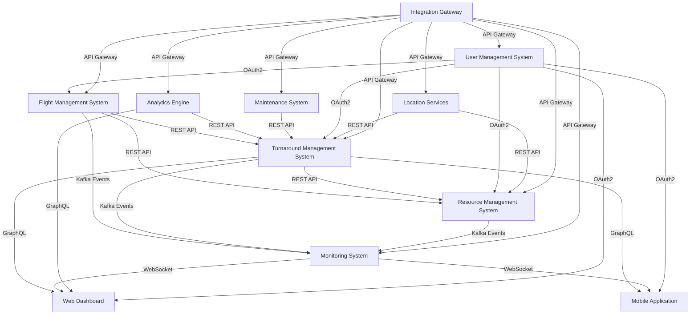

## Application and User Location Diagram

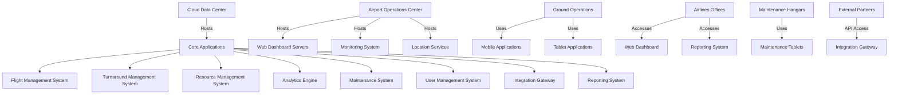

## Application Use-Case Diagram

```mermaid
usecaseDiagram
    actor OperationsManager
    actor GroundCrew
    actor AirlineRep
    actor MaintenanceTech
    actor ITAdmin
    
    OperationsManager --> (Schedule Flights)
    OperationsManager --> (Monitor Turnaround Performance)
    OperationsManager --> (Generate Reports)
    OperationsManager --> (Analyze Performance Data)
    
    GroundCrew --> (Execute Turnaround Tasks)
    GroundCrew --> (Report Issues)
    GroundCrew --> (View Real-time Status)
    GroundCrew --> (Navigate Airport)
    
    AirlineRep --> (View Flight Status)
    AirlineRep --> (Receive Alerts)
    AirlineRep --> (Access Performance Reports)
    
    MaintenanceTech --> (Perform Maintenance)
    MaintenanceTech --> (Update Maintenance Status)
    MaintenanceTech --> (View Maintenance History)
    
    ITAdmin --> (Manage Users)
    ITAdmin --> (Configure System)
    ITAdmin --> (Monitor System Health)
    ITAdmin --> (Manage Integrations)
```

## Enterprise Manageability Diagram

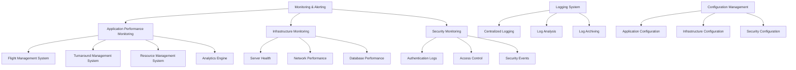

## Process/Application Realization Diagram

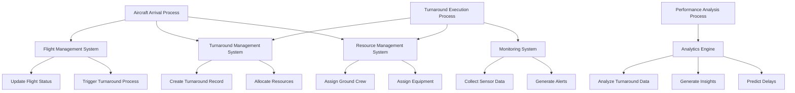

## Software Engineering Diagram

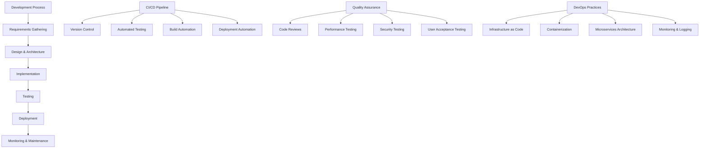

## Application Migration Diagram

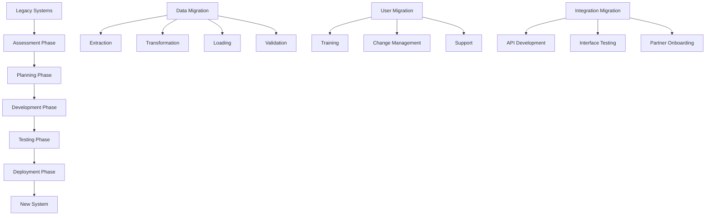

## Software Distribution Diagram

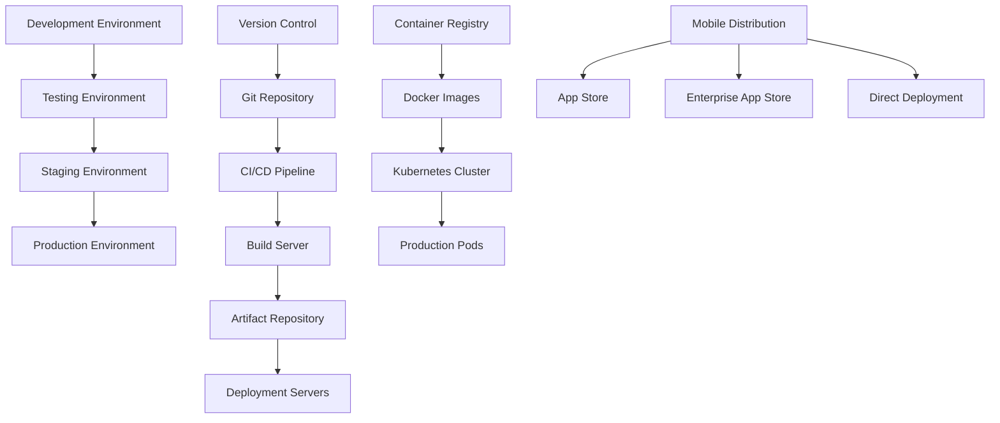

## Solution Architecture Diagrams

### Product Map

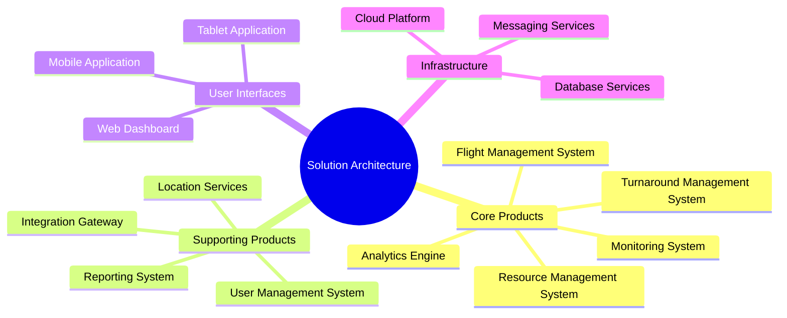

### Solution Component Diagram

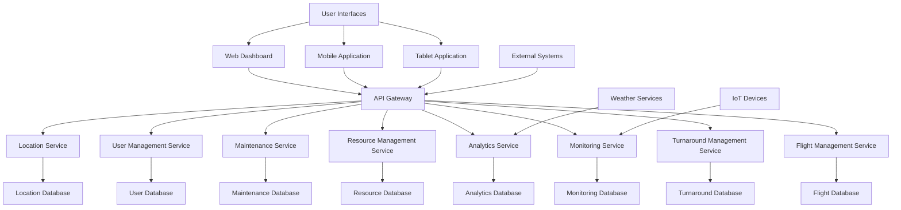

### Solution Value Flow Diagram

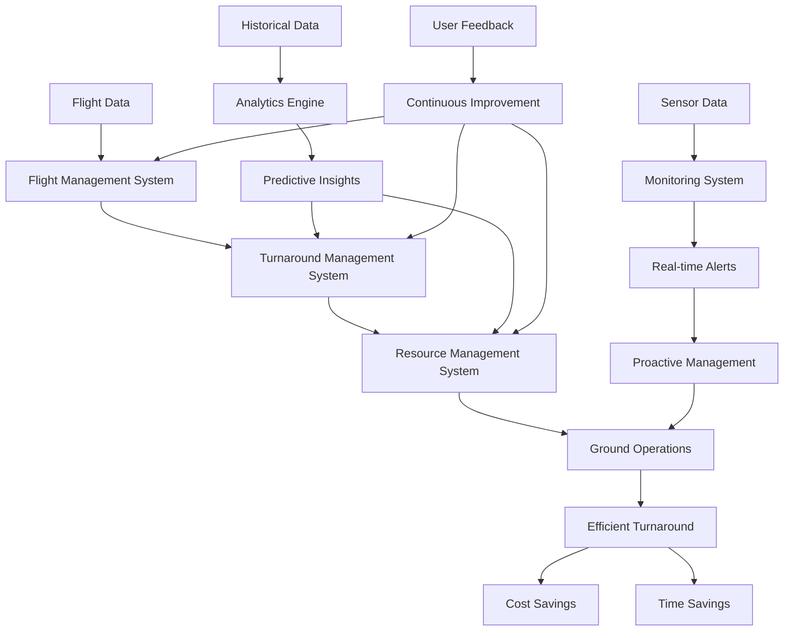

### Solution Process Flow Diagram

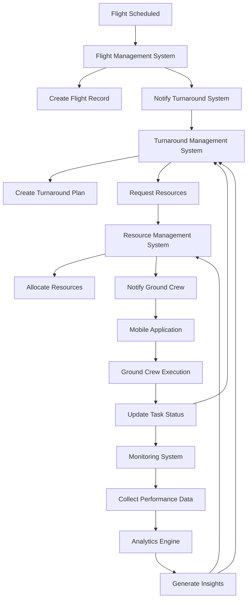

## Application Architecture Overview Diagram

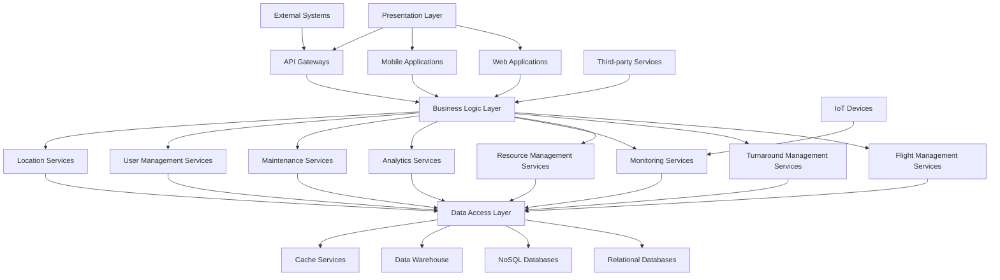