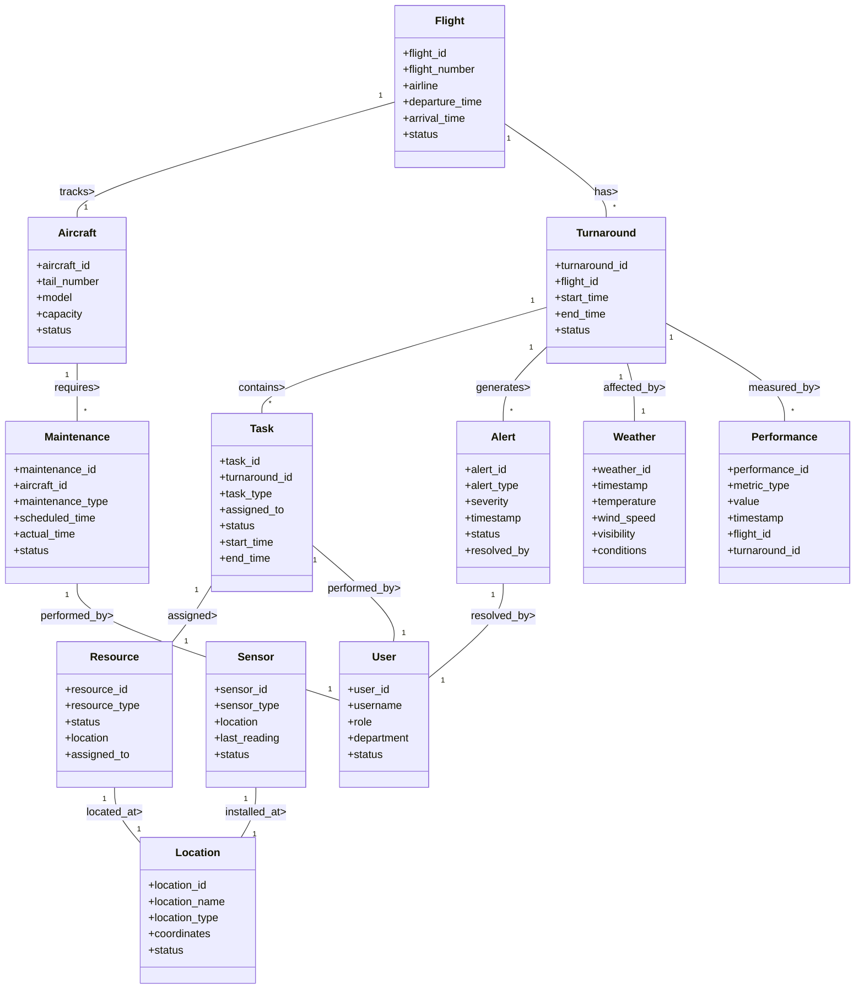
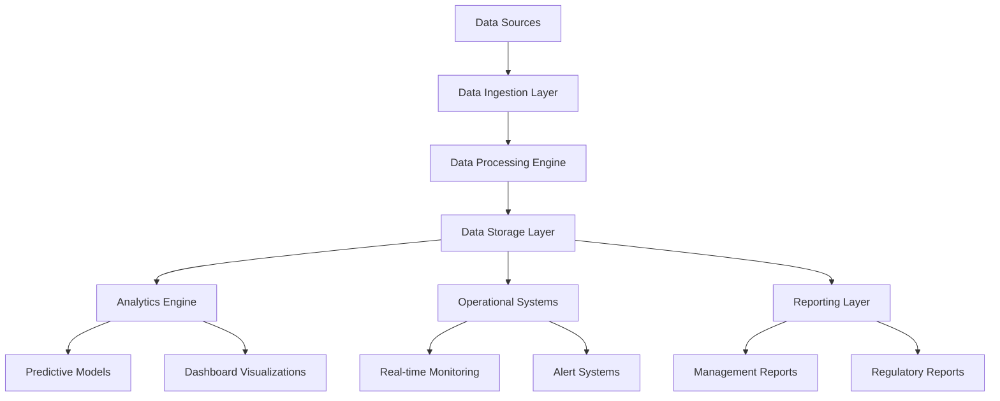
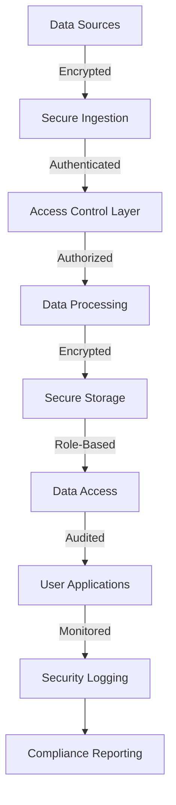
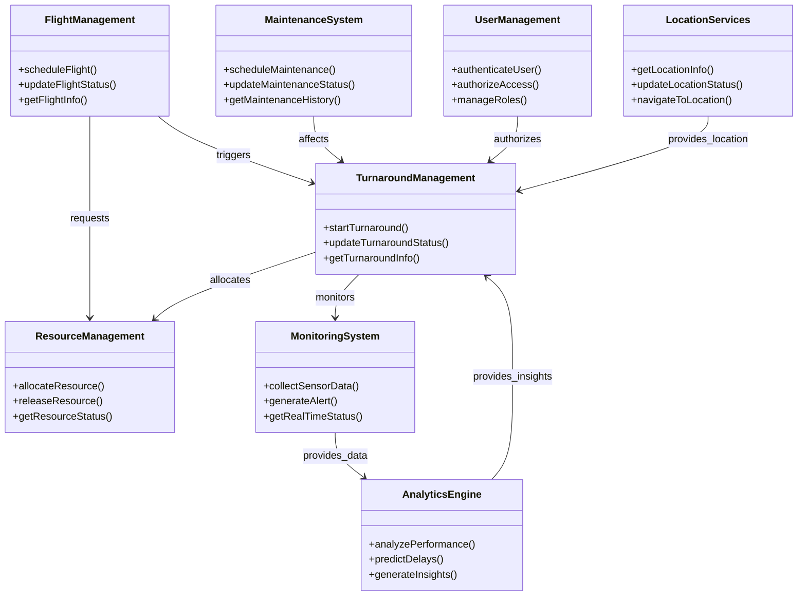
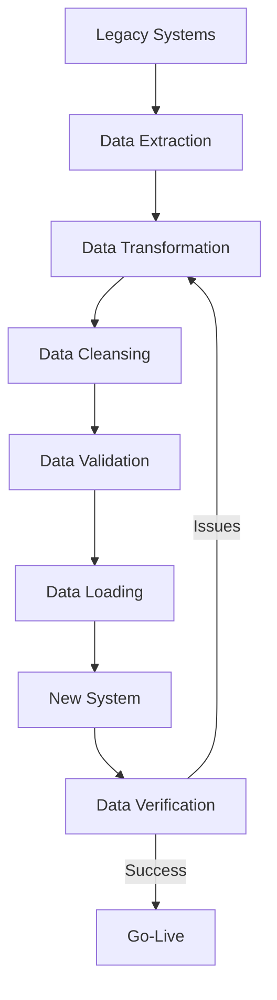
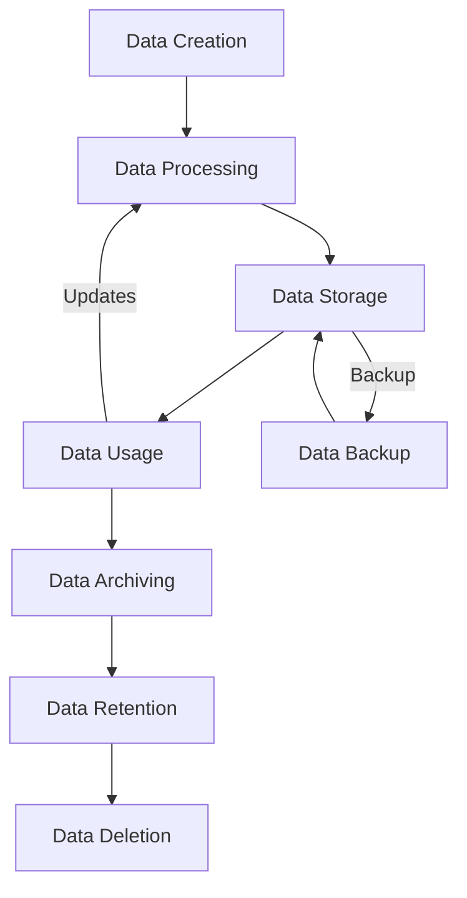
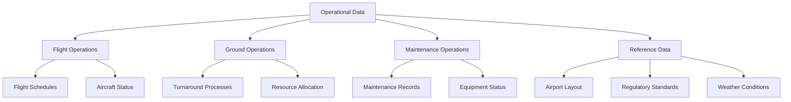
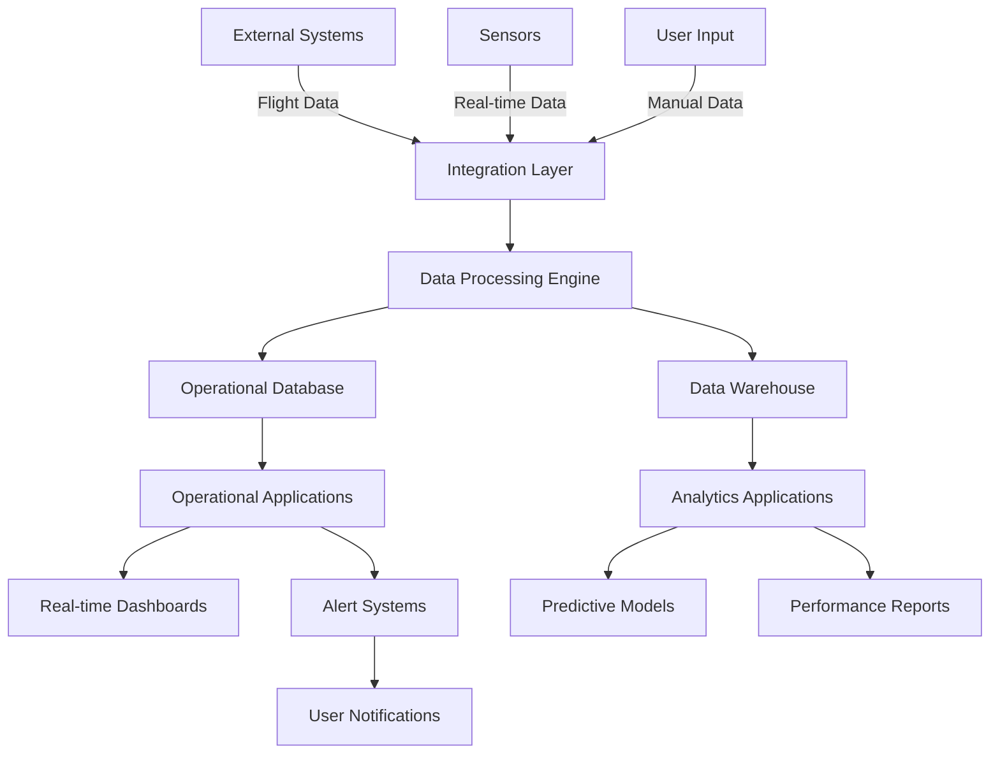

# TOGAF Information Systems Architecture - Data (Phase C)

## Data Entity/Data Component Catalog

### Core Data Entities

| Entity | Description | Business Function | Data Type |
|--------|-------------|-------------------|-----------|
| Flight | Aircraft flight information | Flight Coordination | Master |
| Aircraft | Aircraft specifications and status | Operations | Master |
| Turnaround | Turnaround process details | Ground Operations | Transactional |
| Task | Individual turnaround tasks | Ground Operations | Transactional |
| Resource | Ground handling resources | Resource Management | Master |
| Sensor | IoT sensor data | Monitoring | Reference |
| Alert | System alerts and notifications | Monitoring | Transactional |
| User | System users and roles | Security | Master |
| Location | Airport locations and gates | Operations | Reference |
| Maintenance | Maintenance records | Maintenance | Transactional |
| Weather | Weather conditions | Operations | Reference |
| Performance | Performance metrics | Analytics | Transactional |

### Data Components

| Component | Description | Data Entities | Owner |
|-----------|-------------|---------------|-------|
| Flight Management | Flight scheduling and tracking | Flight, Aircraft | Operations |
| Turnaround Management | Turnaround process tracking | Turnaround, Task | Operations |
| Resource Management | Resource allocation and tracking | Resource, User | Operations |
| Monitoring System | Real-time data collection | Sensor, Alert | IT |
| Analytics Engine | Data analysis and predictions | Performance, Weather | Analytics |
| Maintenance System | Maintenance tracking | Maintenance, Aircraft | Maintenance |
| User Management | User authentication and authorization | User | IT |
| Location Services | Airport layout and navigation | Location | Operations |

## Data Entity/Business Function Matrix

| Data Entity | Flight Coordination | Ground Operations | Maintenance | Analytics | Compliance |
|-------------|--------------------|-------------------|-------------|----------|------------|
| Flight | ✓ (Primary) | ✓ (Reference) | ✓ (Reference) | ✓ (Reference) | ✓ (Reference) |
| Aircraft | ✓ (Reference) | ✓ (Primary) | ✓ (Primary) | ✓ (Reference) | ✓ (Primary) |
| Turnaround | ✓ (Reference) | ✓ (Primary) | ✓ (Reference) | ✓ (Primary) | ✓ (Reference) |
| Task | ✓ (Reference) | ✓ (Primary) | ✓ (Reference) | ✓ (Primary) | ✓ (Reference) |
| Resource | ✓ (Reference) | ✓ (Primary) | ✓ (Reference) | ✓ (Primary) | ✓ (Reference) |
| Sensor | ✓ (Reference) | ✓ (Primary) | ✓ (Reference) | ✓ (Primary) | ✓ (Reference) |
| Alert | ✓ (Reference) | ✓ (Primary) | ✓ (Primary) | ✓ (Primary) | ✓ (Primary) |
| User | ✓ (Reference) | ✓ (Primary) | ✓ (Primary) | ✓ (Reference) | ✓ (Reference) |
| Location | ✓ (Primary) | ✓ (Primary) | ✓ (Reference) | ✓ (Reference) | ✓ (Reference) |
| Maintenance | ✓ (Reference) | ✓ (Reference) | ✓ (Primary) | ✓ (Reference) | ✓ (Primary) |
| Weather | ✓ (Reference) | ✓ (Primary) | ✓ (Reference) | ✓ (Primary) | ✓ (Reference) |
| Performance | ✓ (Reference) | ✓ (Primary) | ✓ (Reference) | ✓ (Primary) | ✓ (Reference) |

## Application/Data Matrix

| Application | Flight | Aircraft | Turnaround | Task | Resource | Sensor | Alert | User | Location | Maintenance | Weather | Performance |
|-------------|--------|----------|------------|------|----------|--------|-------|------|----------|-------------|---------|-------------|
| Flight Management System | ✓ (R/W) | ✓ (R) | ✓ (R) | ✓ (R) | ✓ (R) | ✓ (R) | ✓ (R) | ✓ (R) | ✓ (R/W) | ✓ (R) | ✓ (R) | ✓ (R) |
| Turnaround Management System | ✓ (R) | ✓ (R) | ✓ (R/W) | ✓ (R/W) | ✓ (R/W) | ✓ (R) | ✓ (R/W) | ✓ (R) | ✓ (R) | ✓ (R) | ✓ (R) | ✓ (R/W) |
| Resource Management System | ✓ (R) | ✓ (R) | ✓ (R) | ✓ (R) | ✓ (R/W) | ✓ (R) | ✓ (R) | ✓ (R/W) | ✓ (R) | ✓ (R) | ✓ (R) | ✓ (R) |
| Monitoring System | ✓ (R) | ✓ (R) | ✓ (R) | ✓ (R) | ✓ (R) | ✓ (R/W) | ✓ (R/W) | ✓ (R) | ✓ (R) | ✓ (R) | ✓ (R) | ✓ (R) |
| Analytics Engine | ✓ (R) | ✓ (R) | ✓ (R) | ✓ (R) | ✓ (R) | ✓ (R) | ✓ (R) | ✓ (R) | ✓ (R) | ✓ (R) | ✓ (R) | ✓ (R/W) |
| Maintenance System | ✓ (R) | ✓ (R/W) | ✓ (R) | ✓ (R) | ✓ (R) | ✓ (R) | ✓ (R/W) | ✓ (R) | ✓ (R) | ✓ (R/W) | ✓ (R) | ✓ (R) |
| User Management System | ✓ (R) | ✓ (R) | ✓ (R) | ✓ (R) | ✓ (R) | ✓ (R) | ✓ (R) | ✓ (R/W) | ✓ (R) | ✓ (R) | ✓ (R) | ✓ (R) |
| Location Services | ✓ (R) | ✓ (R) | ✓ (R) | ✓ (R) | ✓ (R) | ✓ (R) | ✓ (R) | ✓ (R) | ✓ (R/W) | ✓ (R) | ✓ (R) | ✓ (R) |

## Logical Data Diagram

## Data Dissemination Diagram

## Data Security Diagram

## Class Diagram

## Class Hierarchy Diagram

```mermaid
classDiagram
    class DataEntity {
        <<abstract>>
        +entity_id
        +created_at
        +updated_at
        +status
        +save()
        +validate()
    }
    
    class Flight extends DataEntity {
        +flight_number
        +airline
        +schedule()
        +updateStatus()
    }
    
    class Aircraft extends DataEntity {
        +tail_number
        +model
        +maintain()
        +inspect()
    }
    
    class Turnaround extends DataEntity {
        +flight_id
        +start_time
        +monitor()
        +complete()
    }
    
    class Task extends DataEntity {
        +task_type
        +assigned_to
        +execute()
        +updateProgress()
    }
    
    class Resource extends DataEntity {
        +resource_type
        +location
        +allocate()
        +release()
    }
    
    class Sensor extends DataEntity {
        +sensor_type
        +last_reading
        +readData()
        +calibrate()
    }
    
    class Alert extends DataEntity {
        +alert_type
        +severity
        +trigger()
        +resolve()
    }
    
    class User extends DataEntity {
        +username
        +role
        +authenticate()
        +authorize()
    }
    
    class Location extends DataEntity {
        +location_name
        +coordinates
        +navigate()
        +updateStatus()
    }
    
    class Maintenance extends DataEntity {
        +maintenance_type
        +scheduled_time
        +perform()
        +document()
    }
    
    class Weather extends DataEntity {
        +timestamp
        +conditions
        +update()
        +forecast()
    }
    
    class Performance extends DataEntity {
        +metric_type
        +value
        +analyze()
        +report()
    }
```

## Data Migration Diagram

## Data Lifecycle Diagram

## Conceptual Data Diagram

## Solution Data Flow Diagram

