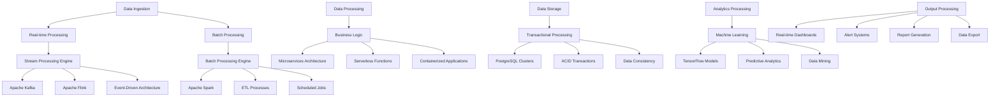

# TOGAF Technology Architecture (Phase D)

## Technology Standards Catalog

### Development Standards

| Standard | Description | Applicability | Compliance Level |
|----------|-------------|---------------|------------------|
| TS-DEV-001 | Java Coding Standards | All Java applications | Mandatory |
| TS-DEV-002 | RESTful API Design | All API development | Mandatory |
| TS-DEV-003 | Microservices Architecture | All new applications | Mandatory |
| TS-DEV-004 | Containerization Standards | All deployable components | Mandatory |
| TS-DEV-005 | CI/CD Pipeline Standards | All development projects | Mandatory |
| TS-DEV-006 | Security Coding Standards | All applications | Mandatory |
| TS-DEV-007 | Frontend Development Standards | All UI development | Mandatory |
| TS-DEV-008 | Database Design Standards | All data storage | Mandatory |

### Infrastructure Standards

| Standard | Description | Applicability | Compliance Level |
|----------|-------------|---------------|------------------|
| TS-INF-001 | Cloud Deployment Standards | All cloud deployments | Mandatory |
| TS-INF-002 | Network Security Standards | All network components | Mandatory |
| TS-INF-003 | Server Configuration Standards | All servers | Mandatory |
| TS-INF-004 | Storage Standards | All data storage | Mandatory |
| TS-INF-005 | Backup and Recovery Standards | All systems | Mandatory |
| TS-INF-006 | Monitoring Standards | All infrastructure | Mandatory |
| TS-INF-007 | High Availability Standards | Critical systems | Mandatory |
| TS-INF-008 | Disaster Recovery Standards | All systems | Mandatory |

### Security Standards

| Standard | Description | Applicability | Compliance Level |
|----------|-------------|---------------|------------------|
| TS-SEC-001 | Authentication Standards | All user access | Mandatory |
| TS-SEC-002 | Authorization Standards | All system access | Mandatory |
| TS-SEC-003 | Data Encryption Standards | All sensitive data | Mandatory |
| TS-SEC-004 | Network Security Standards | All network traffic | Mandatory |
| TS-SEC-005 | Audit Logging Standards | All systems | Mandatory |
| TS-SEC-006 | Vulnerability Management | All systems | Mandatory |
| TS-SEC-007 | Incident Response Standards | All security incidents | Mandatory |
| TS-SEC-008 | Compliance Standards | All regulated systems | Mandatory |

### Data Standards

| Standard | Description | Applicability | Compliance Level |
|----------|-------------|---------------|------------------|
| TS-DATA-001 | Data Modeling Standards | All data entities | Mandatory |
| TS-DATA-002 | Data Quality Standards | All data | Mandatory |
| TS-DATA-003 | Data Retention Standards | All data storage | Mandatory |
| TS-DATA-004 | Data Integration Standards | All data exchanges | Mandatory |
| TS-DATA-005 | Master Data Management | Critical data entities | Mandatory |
| TS-DATA-006 | Data Governance Standards | All data | Mandatory |
| TS-DATA-007 | Data Privacy Standards | Personal data | Mandatory |
| TS-DATA-008 | Data Backup Standards | All data | Mandatory |

## Technology Portfolio Catalog

### Computing Platforms

| Technology | Type | Description | Usage |
|------------|------|-------------|-------|
| Kubernetes | Container Orchestration | Container management platform | Core infrastructure |
| Docker | Containerization | Container runtime environment | Application deployment |
| AWS EC2 | Cloud Computing | Virtual servers | Core infrastructure |
| AWS Lambda | Serverless Computing | Event-driven functions | Analytics, integrations |
| OpenShift | Container Platform | Enterprise Kubernetes | Development, staging |

### Storage Technologies

| Technology | Type | Description | Usage |
|------------|------|-------------|-------|
| PostgreSQL | Relational Database | ACID-compliant database | Transactional data |
| MongoDB | NoSQL Database | Document-oriented database | Unstructured data |
| Redis | In-memory Database | Caching and session management | Performance optimization |
| Amazon S3 | Object Storage | Scalable object storage | File storage, backups |
| Elasticsearch | Search Engine | Full-text search and analytics | Search, logging |
| InfluxDB | Time Series Database | Time-series data storage | Sensor data, metrics |

### Networking Technologies

| Technology | Type | Description | Usage |
|------------|------|-------------|-------|
| AWS VPC | Virtual Network | Isolated cloud network | Core networking |
| Cisco ACI | Software-Defined Networking | Network automation | Data center networking |
| F5 BIG-IP | Load Balancing | Traffic management | High availability |
| AWS Direct Connect | Dedicated Network | Private connection to AWS | Hybrid cloud |
| Cloudflare | CDN & Security | Content delivery and DDoS protection | Web applications |
| OpenVPN | VPN | Secure remote access | Remote connectivity |

### Middleware Technologies

| Technology | Type | Description | Usage |
|------------|------|-------------|-------|
| Apache Kafka | Message Broker | Distributed event streaming | Real-time data processing |
| RabbitMQ | Message Queue | Message queuing | Asynchronous processing |
| Redis | Message Broker | Pub/Sub messaging | Real-time notifications |
| Apache Camel | Integration Framework | Enterprise integration | System integration |
| Spring Cloud | Microservices Framework | Service discovery, config | Microservices architecture |
| Istio | Service Mesh | Service-to-service communication | Microservices networking |

### Development Technologies

| Technology | Type | Description | Usage |
|------------|------|-------------|-------|
| Java | Programming Language | Enterprise application development | Backend services |
| Spring Boot | Framework | Java application framework | Microservices development |
| Node.js | Runtime | JavaScript runtime | Real-time applications |
| React | Framework | Frontend development | Web applications |
| React Native | Framework | Mobile development | Mobile applications |
| Python | Programming Language | Data science, scripting | Analytics, automation |
| TensorFlow | ML Framework | Machine learning | Predictive analytics |

### Monitoring and Management Technologies

| Technology | Type | Description | Usage |
|------------|------|-------------|-------|
| Prometheus | Monitoring | Metrics collection and alerting | Infrastructure monitoring |
| Grafana | Visualization | Dashboards and visualization | Monitoring dashboards |
| ELK Stack | Logging | Log collection and analysis | Centralized logging |
| Nagios | Monitoring | Infrastructure monitoring | System health monitoring |
| New Relic | APM | Application performance monitoring | Application monitoring |
| Splunk | SIEM | Security information and event management | Security monitoring |
| Jenkins | CI/CD | Continuous integration and delivery | DevOps pipeline |

### Security Technologies

| Technology | Type | Description | Usage |
|------------|------|-------------|-------|
| HashiCorp Vault | Secrets Management | Secure secrets storage | Credential management |
| Okta | Identity Management | Identity and access management | User authentication |
| AWS IAM | Access Control | AWS access management | Cloud security |
| Aqua Security | Container Security | Container security scanning | Container security |
| Tenable | Vulnerability Management | Vulnerability scanning | Security compliance |
| Palo Alto | Firewall | Next-generation firewall | Network security |
| Qualys | Security Assessment | Security scanning | Compliance scanning |

## System/Technology Matrix

| System | Computing | Storage | Networking | Middleware | Development | Monitoring | Security |
|--------|-----------|---------|-----------|------------|-------------|------------|----------|
| Flight Management System | Kubernetes, AWS EC2 | PostgreSQL, Redis | AWS VPC, F5 BIG-IP | Spring Cloud, Kafka | Java, Spring Boot | Prometheus, New Relic | HashiCorp Vault, Okta |
| Turnaround Management System | Kubernetes, AWS EC2 | PostgreSQL, Redis | AWS VPC, F5 BIG-IP | Spring Cloud, Kafka | Java, Spring Boot | Prometheus, New Relic | HashiCorp Vault, Okta |
| Resource Management System | Kubernetes, AWS EC2 | PostgreSQL, Redis | AWS VPC, F5 BIG-IP | Spring Cloud, Kafka | Java, Spring Boot | Prometheus, New Relic | HashiCorp Vault, Okta |
| Monitoring System | Kubernetes, AWS Lambda | InfluxDB, Elasticsearch | AWS VPC, F5 BIG-IP | Kafka, RabbitMQ | Node.js | Prometheus, Grafana | HashiCorp Vault, Okta |
| Analytics Engine | AWS EC2, AWS Lambda | PostgreSQL, MongoDB | AWS VPC | Kafka | Python, TensorFlow | Prometheus, New Relic | HashiCorp Vault, Okta |
| Maintenance System | Kubernetes, AWS EC2 | PostgreSQL, Redis | AWS VPC, F5 BIG-IP | Spring Cloud, Kafka | Java, Spring Boot | Prometheus, New Relic | HashiCorp Vault, Okta |
| User Management System | Kubernetes, AWS EC2 | PostgreSQL, Redis | AWS VPC, F5 BIG-IP | Spring Cloud | Java, Spring Boot | Prometheus, New Relic | HashiCorp Vault, Okta |
| Location Services | Kubernetes, AWS EC2 | PostgreSQL, PostGIS | AWS VPC, F5 BIG-IP | Spring Cloud | Java, Spring Boot | Prometheus, New Relic | HashiCorp Vault, Okta |
| Integration Gateway | Kubernetes, AWS EC2 | Redis | AWS VPC, F5 BIG-IP | Spring Cloud Gateway | Java, Spring Boot | Prometheus, New Relic | HashiCorp Vault, Okta |
| Mobile Application | N/A | N/A | AWS VPC | GraphQL | React Native | New Relic | Okta |
| Web Dashboard | N/A | N/A | AWS VPC, Cloudflare | GraphQL | React, TypeScript | New Relic | Okta |
| Reporting System | Kubernetes, AWS EC2 | PostgreSQL | AWS VPC, F5 BIG-IP | Spring Cloud | Java, JasperReports | Prometheus, New Relic | HashiCorp Vault, Okta |

## Environments and Locations Diagram

```mermaid
flowchart TD
    A[Development Environment] --> B[Local Development]
    A --> C[Shared Development]
    B --> D[Developer Workstations]
    C --> E[Development Servers]
    
    F[Testing Environment] --> G[Unit Testing]
    F --> H[Integration Testing]
    F --> I[User Acceptance Testing]
    G --> J[Automated Test Servers]
    H --> K[Integration Test Servers]
    I --> L[UAT Servers]
    
    M[Staging Environment] --> N[Pre-production Servers]
    N --> O[Performance Testing]
    N --> P[Security Testing]
    
    Q[Production Environment] --> R[Primary Data Center]
    Q --> S[Disaster Recovery Site]
    R --> T[Production Servers]
    R --> U[Database Clusters]
    S --> V[Backup Servers]
    S --> W[Replication Services]
    
    X[Cloud Environment] --> Y[AWS Region 1]
    X --> Z[AWS Region 2]
    Y --> AA[Production Services]
    Y --> AB[Development Services]
    Z --> AC[Disaster Recovery Services]
    
    AD[On-premises] --> AE[Airport Data Center]
    AE --> AF[Core Infrastructure]
    AE --> AG[Network Operations]
    
    AH[Edge Locations] --> AI[Airport Gates]
    AI --> AJ[Edge Computing Nodes]
    AI --> AK[IoT Gateways]
```

## Platform Decomposition Diagram

```mermaid
flowchart TD
    A[Technology Platform] --> B[Compute Platform]
    A --> C[Storage Platform]
    A --> D[Network Platform]
    A --> E[Middleware Platform]
    A --> F[Development Platform]
    A --> G[Monitoring Platform]
    A --> H[Security Platform]
    
    B --> I[Container Orchestration]
    B --> J[Serverless Computing]
    B --> K[Virtual Machines]
    
    C --> L[Relational Databases]
    C --> M[NoSQL Databases]
    C --> N[Object Storage]
    C --> O[Time Series Databases]
    
    D --> P[Software-Defined Networking]
    D --> Q[Load Balancing]
    D --> R[VPN Services]
    D --> S[Firewall Services]
    
    E --> T[Message Brokers]
    E --> U[API Gateways]
    E --> V[Service Mesh]
    E --> W[Integration Frameworks]
    
    F --> X[Programming Languages]
    F --> Y[Development Frameworks]
    F --> Z[CI/CD Pipelines]
    F --> AA[Version Control]
    
    G --> AB[Metrics Collection]
    G --> AC[Logging Systems]
    G --> AD[APM Tools]
    G --> AE[Visualization Tools]
    
    H --> AF[Identity Management]
    H --> AG[Secrets Management]
    H --> AH[Vulnerability Scanning]
    H --> AI[Security Monitoring]
```

## Processing Diagram

## Networked Computing/Hardware Diagram

```mermaid
flowchart TD
    A[Core Data Center] --> B[Server Racks]
    B --> C[Compute Nodes]
    B --> D[Storage Arrays]
    B --> E[Network Switches]
    
    F[Cloud Infrastructure] --> G[Virtual Machines]
    F --> H[Container Clusters]
    F --> I[Serverless Functions]
    
    J[Edge Computing] --> K[IoT Gateways]
    J --> L[Edge Servers]
    J --> M[Mobile Devices]
    
    N[Network Infrastructure] --> O[Core Routers]
    N --> P[Distribution Switches]
    N --> Q[Access Switches]
    N --> R[Wireless Access Points]
    
    S[Security Infrastructure] --> T[Firewalls]
    S --> U[Intrusion Detection]
    S --> V[VPN Concentrators]
    S --> W[Load Balancers]
    
    X[Storage Infrastructure] --> Y[SAN Storage]
    X --> Z[NAS Storage]
    X --> AA[Object Storage]
    X --> AB[Backup Systems]
    
    AC[Monitoring Infrastructure] --> AD[Monitoring Servers]
    AC --> AE[Logging Servers]
    AC --> AF[APM Servers]
    AC --> AG[Security Monitoring]
```

## Communications Engineering Diagram

```mermaid
flowchart TD
    A[Network Architecture] --> B[Core Network]
    B --> C[Data Center Networking]
    B --> D[Cloud Networking]
    B --> E[WAN Connectivity]
    
    C --> F[Spine-Leaf Architecture]
    C --> G[Software-Defined Networking]
    C --> H[Network Virtualization]
    
    D --> I[VPC Design]
    D --> J[Subnet Architecture]
    D --> K[Security Groups]
    
    E --> L[MPLS Networks]
    E --> M[Internet Connectivity]
    E --> N[Direct Connect]
    
    O[Wireless Networking] --> P[Wi-Fi Infrastructure]
    O --> Q[5G Networking]
    O --> R[IoT Connectivity]
    
    S[Network Services] --> T[DNS Services]
    S --> U[DHCP Services]
    S --> V[IP Address Management]
    S --> W[Network Time Protocol]
    
    X[Network Security] --> Y[Firewall Rules]
    X --> Z[Intrusion Prevention]
    X --> AA[Network Segmentation]
    X --> AB[VPN Services]
    
    AC[Network Monitoring] --> AD[Network Performance]
    AC --> AE[Traffic Analysis]
    AC --> AF[Bandwidth Management]
    AC --> AG[Network Alerting]
```

## Network and Communications Diagram

```mermaid
flowchart TD
    A[Airport Network] --> B[Core Network Infrastructure]
    B --> C[Data Center Network]
    B --> D[Cloud Network]
    B --> E[WAN Connectivity]
    
    C --> F[Server Farm]
    C --> G[Storage Network]
    C --> H[Network Services]
    
    D --> I[AWS VPC]
    D --> J[Azure VNet]
    D --> K[Hybrid Cloud Connectivity]
    
    E --> L[Internet Connection]
    E --> M[MPLS Network]
    E --> N[Direct Cloud Connect]
    
    O[Wireless Network] --> P[Wi-Fi Network]
    O --> Q[5G Network]
    O --> R[IoT Network]
    
    S[Edge Network] --> T[Gate Connectivity]
    S --> U[Mobile Device Network]
    S --> V[Sensor Network]
    
    W[Security Network] --> X[Firewall Cluster]
    W --> Y[IDS/IPS Systems]
    W --> Z[VPN Gateway]
    
    AA[Network Management] --> AB[Network Monitoring]
    AA --> AC[Network Configuration]
    AA --> AD[Network Security]
    AA --> AE[Network Performance]
    
    AF[External Connectivity] --> AG[Airlines Network]
    AF --> AH[Regulatory Agencies]
    AF --> AI[Technology Partners]
    AF --> AJ[Public Internet]
```

