# TOGAF Opportunities & Solutions (Phase E)

## Project Context Diagram

```mermaid
flowchart TD
    A[Turnaround Management System Project] --> B[Business Context]
    A --> C[Technical Context]
    A --> D[Organizational Context]
    A --> E[External Context]
    
    B --> F[Airport Operations Improvement]
    B --> G[Cost Reduction Initiatives]
    B --> H[Customer Experience Enhancement]
    B --> I[Regulatory Compliance Requirements]
    
    C --> J[Legacy System Replacement]
    C --> K[Technology Modernization]
    C --> L[Cloud Migration Strategy]
    C --> M[Data Integration Challenges]
    
    D --> N[IT Department Capabilities]
    D --> O[Operations Department Needs]
    D --> P[Executive Leadership Support]
    D --> Q[Change Management Requirements]
    
    E --> R[Airlines Partnerships]
    E --> S[Technology Vendors]
    E --> T[Regulatory Agencies]
    E --> U[Industry Standards]
    
    V[Project Scope] --> W[In Scope]
    V --> X[Out of Scope]
    
    W --> Y[Real-time Monitoring System]
    W --> Z[Predictive Analytics Engine]
    W --> AA[Mobile Application Development]
    W --> AB[System Integration Layer]
    W --> AC[User Training Program]
    
    X --> AD[Aircraft Maintenance Systems]
    X --> AE[Passenger Processing Systems]
    X --> AF[Air Traffic Control Systems]
    X --> AG[Financial Management Systems]
```

## Benefits Diagram

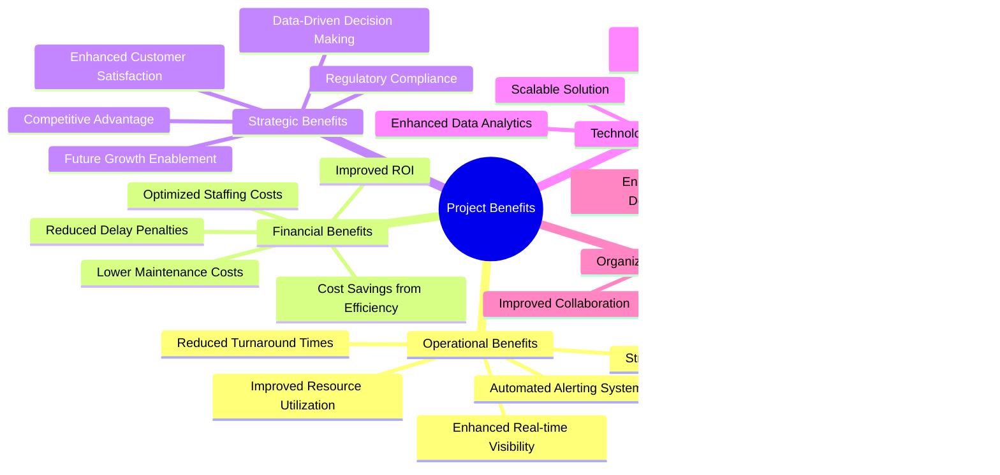

## Implementation Roadmap

### Phase 1: Foundation (Months 1-3)

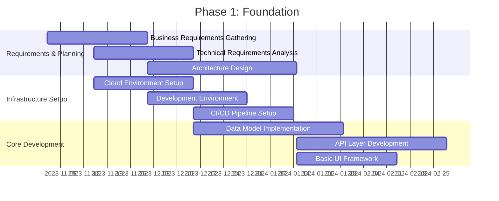

### Phase 2: Core Implementation (Months 4-8)

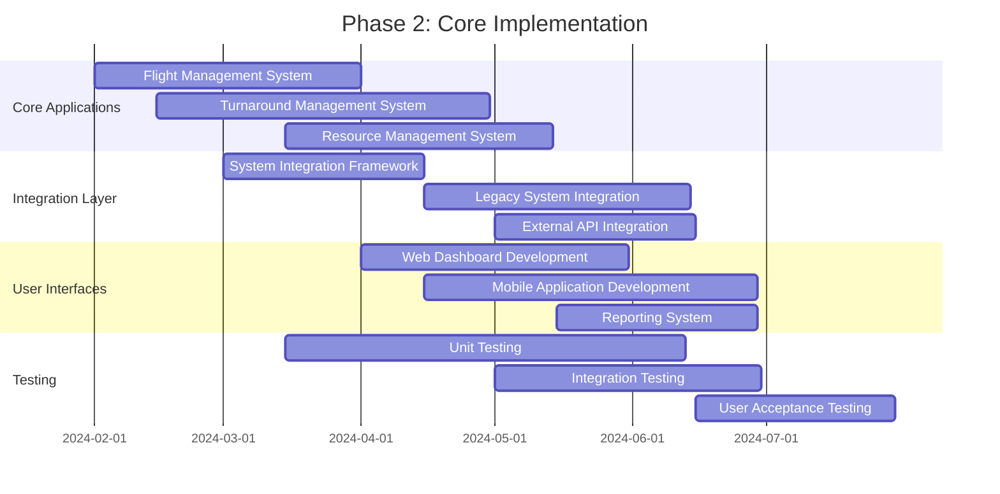

### Phase 3: Advanced Features (Months 9-12)

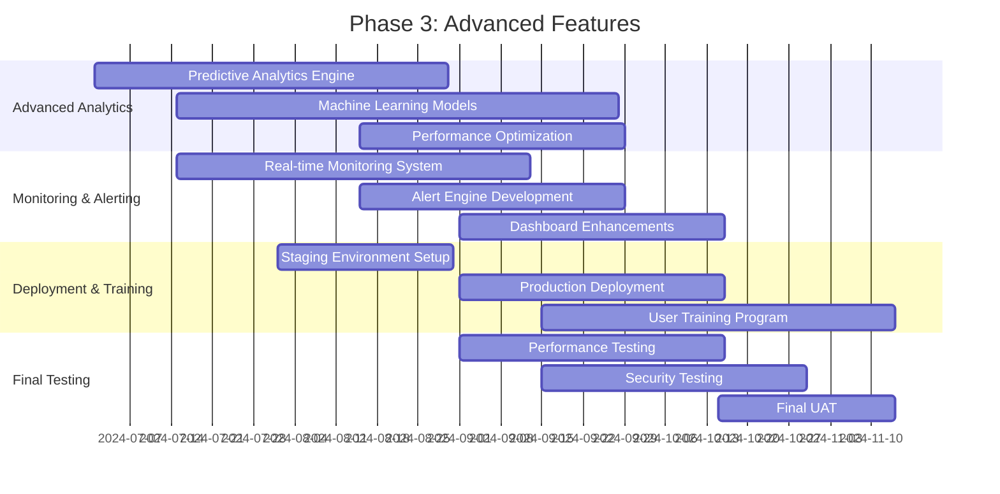

### Phase 4: Go-Live & Optimization (Months 13-15)

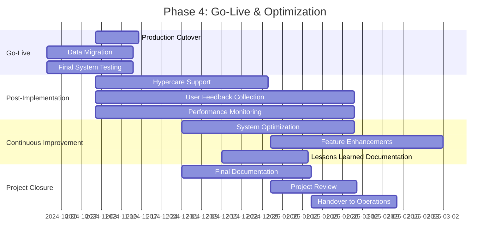

## Migration Strategy

### Current State Assessment

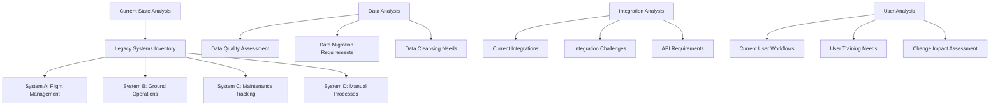

### Migration Approach

```mermaid
flowchart TD
    A[Migration Strategy] --> B[Phased Approach]
    A --> C[Parallel Run Strategy]
    A --> D[Big Bang Approach]
    
    B --> E[Phase 1: Non-Critical Systems]
    B --> F[Phase 2: Core Systems]
    B --> G[Phase 3: Advanced Features]
    
    C --> H[Legacy System Parallel Run]
    C --> I[Data Synchronization]
    C --> J[User Transition Period]
    
    D --> K[Full Cutover]
    D --> L[Comprehensive Testing]
    D --> M[Rollback Plan]
    
    N[Data Migration Plan] --> O[Extraction Strategy]
    N --> P[Transformation Rules]
    N --> Q[Loading Process]
    N --> R[Validation Procedures]
    
    S[User Migration Plan] --> T[Training Program]
    S --> U[Change Management]
    S --> V[Support Structure]
    
    W[Risk Mitigation] --> X[Backup & Recovery]
    W --> Y[Rollback Procedures]
    W --> Z[Contingency Planning]
```

### Migration Timeline

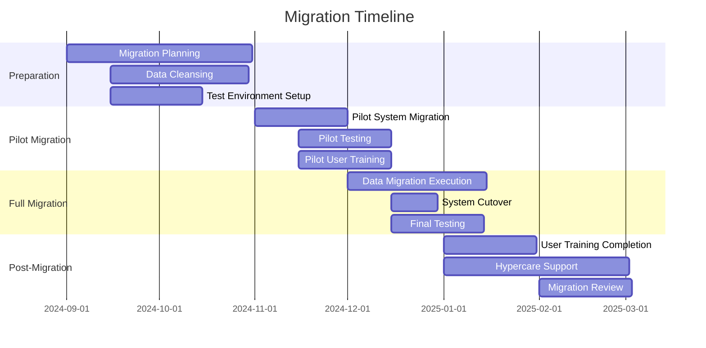

## Implementation Challenges and Mitigation

### Key Challenges

| Challenge | Impact | Mitigation Strategy | Owner |
|-----------|--------|---------------------|-------|
| Legacy System Integration | High | Develop robust integration layer | IT Department |
| Data Quality Issues | Medium | Implement data cleansing processes | Data Team |
| User Resistance | Medium | Comprehensive change management | HR Department |
| Technical Complexity | High | Phased implementation approach | Architecture Team |
| Resource Constraints | Medium | Prioritize critical features | Project Management |
| Regulatory Compliance | High | Early engagement with regulators | Compliance Team |
| Performance Requirements | High | Performance testing and optimization | Development Team |
| Security Concerns | High | Security-by-design approach | Security Team |

### Risk Assessment Matrix

```mermaid
flowchart TD
    A[High Impact, High Likelihood] --> B[Legacy System Integration]
    A --> C[Regulatory Compliance]
    A --> D[Security Concerns]
    
    E[High Impact, Medium Likelihood] --> F[Technical Complexity]
    E --> G[Performance Requirements]
    
    H[Medium Impact, High Likelihood] --> I[User Resistance]
    H --> J[Resource Constraints]
    
    K[Medium Impact, Medium Likelihood] --> L[Data Quality Issues]
    K --> M[Vendor Dependencies]
    
    N[Low Impact, High Likelihood] --> O[Minor User Interface Issues]
    N --> P[Documentation Gaps]
    
    Q[Low Impact, Low Likelihood] --> R[Minor Bug Fixes]
    Q --> S[Cosmetic Issues]
```

## Solution Architecture Evolution

### Current Architecture

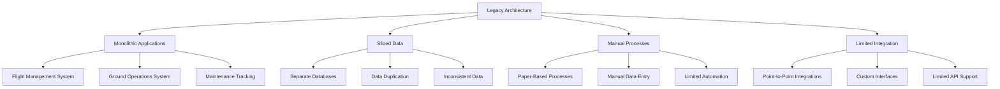

### Target Architecture

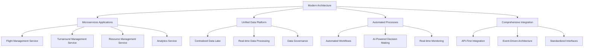

### Architecture Evolution Path

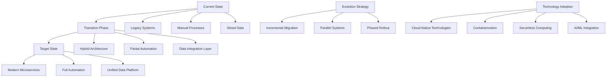

## Business Transformation Roadmap

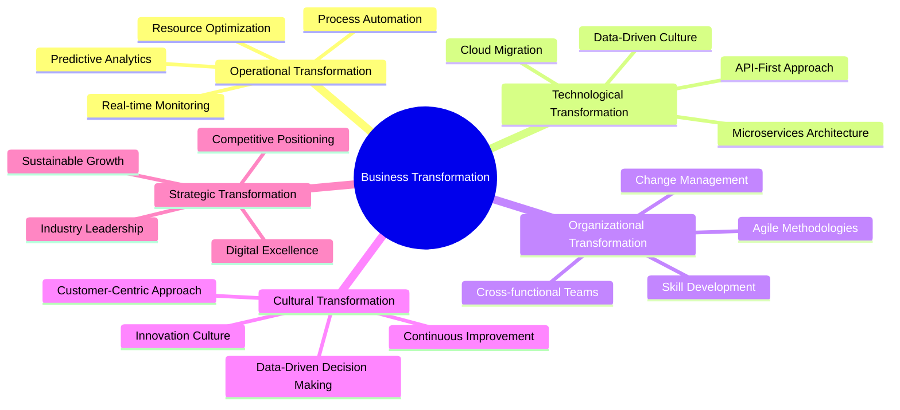

## Implementation Governance

### Governance Structure

```mermaid
flowchart TD
    A[Steering Committee] --> B[Executive Sponsorship]
    A --> C[Strategic Direction]
    A --> D[Resource Allocation]
    
    E[Project Management Office] --> F[Project Planning]
    E --> G[Risk Management]
    E --> H[Progress Tracking]
    
    I[Architecture Review Board] --> J[Technical Standards]
    I --> K[Design Reviews]
    I --> L[Technology Selection]
    
    M[Change Control Board] --> N[Change Requests]
    M --> O[Impact Assessment]
    M --> P[Approval Process]
    
    Q[Quality Assurance Team] --> R[Testing Standards]
    Q --> S[Quality Metrics]
    Q --> T[Compliance Verification]
    
    U[Security Review Board] --> V[Security Standards]
    U --> W[Vulnerability Assessment]
    U --> X[Compliance Monitoring]
```

### Governance Processes

| Process | Frequency | Responsible | Deliverables |
|---------|-----------|-------------|--------------|
| Steering Committee Meeting | Monthly | Steering Committee | Strategic decisions, resource approvals |
| Project Status Review | Weekly | PMO | Progress reports, risk updates |
| Architecture Review | Bi-weekly | Architecture Review Board | Design approvals, technical guidance |
| Change Control Meeting | As needed | Change Control Board | Change approvals, impact assessments |
| Quality Assurance Review | Weekly | QA Team | Test results, quality metrics |
| Security Review | Monthly | Security Review Board | Security assessments, compliance reports |
| Stakeholder Update | Bi-weekly | Project Manager | Progress updates, issue resolution |
| Risk Assessment Meeting | Monthly | Risk Management Team | Risk analysis, mitigation plans |

### Decision-Making Framework

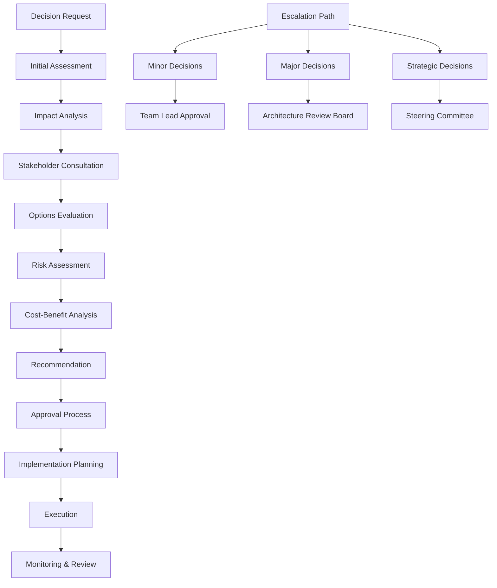

## Success Metrics and KPIs

### Implementation Success Metrics

| Metric | Target | Measurement | Owner |
|--------|--------|-------------|-------|
| Project Completion on Time | 100% | Project timeline adherence | PMO |
| Budget Adherence | ±5% | Budget variance | Finance |
| System Availability | 99.9% | Uptime percentage | IT Operations |
| Data Migration Accuracy | 99.5% | Data validation results | Data Team |
| User Adoption Rate | 90% | Active users percentage | Training Team |
| Training Completion Rate | 100% | Training attendance | HR |
| System Performance | <2s response | Performance testing | Development Team |
| Security Compliance | 100% | Security audit results | Security Team |

### Business Impact KPIs

| KPI | Baseline | Target | Measurement Frequency | Owner |
|-----|----------|--------|----------------------|-------|
| Average Turnaround Time | 60 minutes | 45 minutes | Per flight | Operations |
| On-time Departures | 85% | 95% | Daily | Operations |
| Resource Utilization | 70% | 85% | Hourly | Operations |
| Operational Costs | $X million | $X-15% million | Monthly | Finance |
| Delay Prediction Accuracy | N/A | 90% | Per prediction | Analytics |
| User Satisfaction | 75% | 90% | Quarterly survey | HR |
| System ROI | N/A | 200% | Annual calculation | Finance |
| Regulatory Compliance | 95% | 100% | Annual audit | Compliance |

### Continuous Improvement Metrics

| Metric | Target | Measurement | Owner |
|--------|--------|-------------|-------|
| System Enhancements | Quarterly | Number of improvements | Development Team |
| User Feedback Implementation | 80% | Feedback resolution rate | Product Team |
| Performance Optimization | Continuous | Response time improvement | Development Team |
| New Feature Adoption | 90% | Feature usage percentage | Product Team |
| System Reliability | 99.95% | Uptime improvement | IT Operations |
| Security Patch Compliance | 100% | Patch deployment rate | Security Team |
| Data Quality Improvement | Continuous | Data accuracy percentage | Data Team |
| Process Automation | Continuous | Manual process reduction | Operations |

## Stakeholder Communication Plan

### Communication Matrix

| Stakeholder | Communication Method | Frequency | Responsible | Content |
|-------------|----------------------|-----------|-------------|---------|
| Executive Leadership | Executive Briefings | Monthly | Project Sponsor | Strategic updates, ROI analysis |
| Steering Committee | Formal Presentations | Monthly | Project Manager | Progress reports, risk analysis |
| Operations Management | Operational Updates | Bi-weekly | Operations Lead | System impact, process changes |
| IT Department | Technical Updates | Weekly | Technical Lead | Technical progress, issues |
| Ground Crew | Team Meetings | Weekly | Training Team | System training, user guidance |
| Airlines | Stakeholder Meetings | Monthly | Account Manager | System benefits, integration updates |
| Regulatory Agencies | Compliance Reports | Quarterly | Compliance Officer | Compliance status, audit results |
| Technology Partners | Vendor Meetings | Bi-weekly | Technical Lead | Integration progress, technical issues |
| End Users | Newsletters | Monthly | Communication Team | System updates, tips and tricks |
| Training Team | Training Sessions | As needed | Training Lead | User training, system education |

### Communication Channels

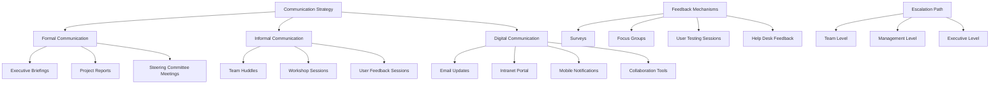

## Project Benefits Realization

### Benefits Realization Timeline

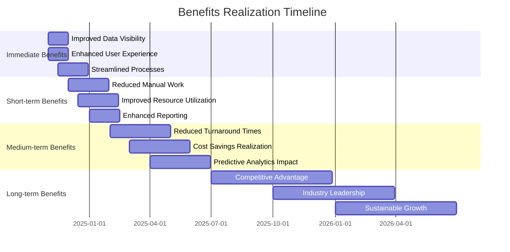

### Benefits Realization Framework

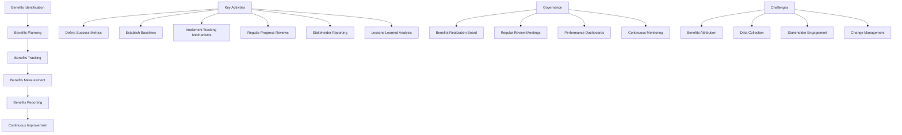

## Future State Vision

### Future Architecture Evolution

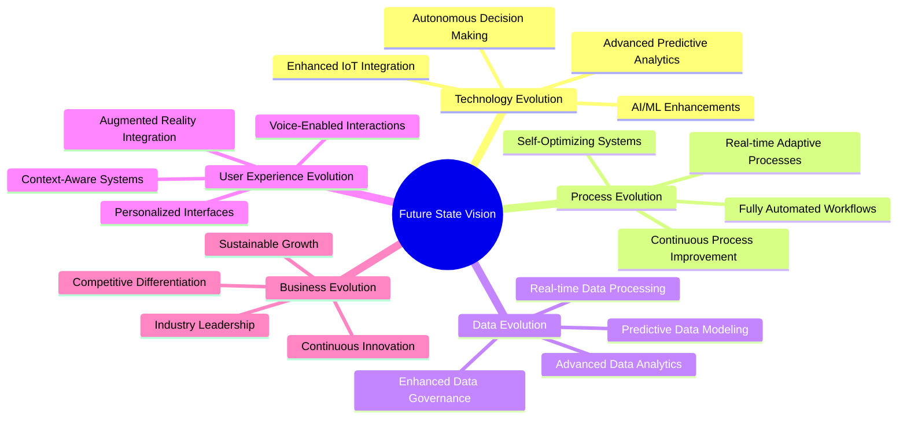

### Innovation Roadmap

```mermaid
flowchart TD
    A[Current State] --> B[Near-Term Innovations]
    B --> C[Medium-Term Innovations]
    C --> D[Long-Term Innovations]
    
    B --> E[AI-Powered Predictions]
    B --> F[Enhanced Mobile Features]
    B --> G[Advanced Analytics]
    
    C --> H[Autonomous Decision Making]
    C --> I[AR/VR Integration]
    C --> J[Advanced IoT Network]
    
    D --> K[Fully Autonomous Operations]
    D --> L[AI-Driven Optimization]
    D --> M[Next-Gen User Interfaces]
    
    N[Innovation Strategy] --> O[Research & Development]
    N --> P[Pilot Programs]
    N --> Q[Technology Partnerships]
    N --> R[Continuous Improvement]
```

### Strategic Alignment

```mermaid
flowchart TD
    A[Business Strategy] --> B[Digital Transformation]
    A --> C[Operational Excellence]
    A --> D[Customer Experience]
    
    B --> E[Technology Modernization]
    B --> F[Data-Driven Culture]
    B --> G[Innovation Leadership]
    
    C --> H[Process Optimization]
    C --> I[Resource Efficiency]
    C --> J[Performance Improvement]
    
    D --> K[Enhanced Service Quality]
    D --> L[Improved Satisfaction]
    D --> M[Competitive Advantage]
    
    N[Architecture Alignment] --> O[Business Goals Support]
    N --> P[Technology Enablement]
    N --> Q[Strategic Implementation]
    N --> R[Continuous Evolution]
```