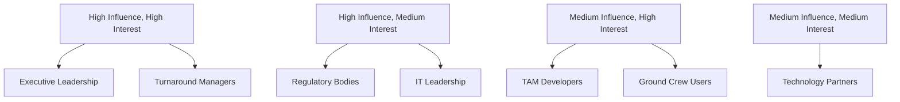
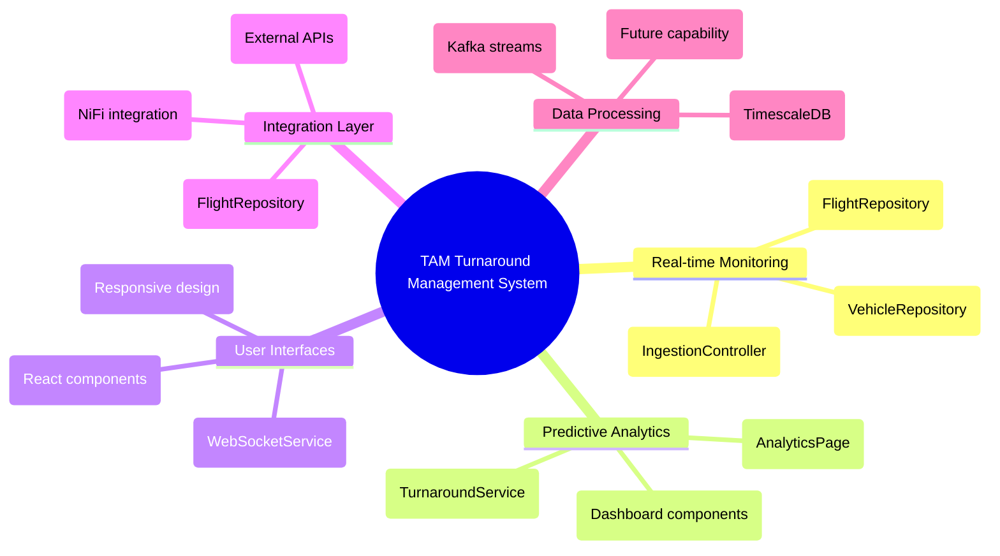
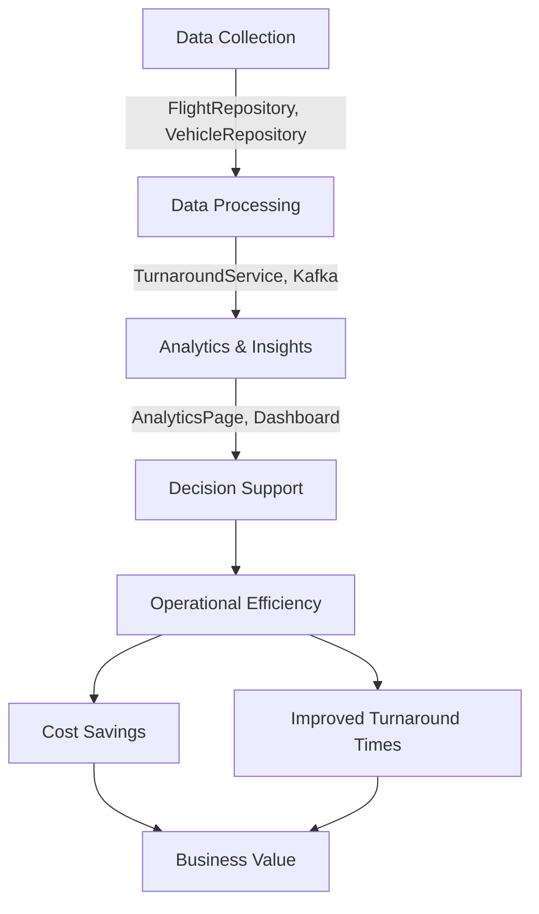
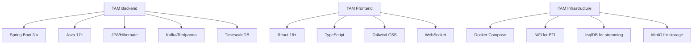
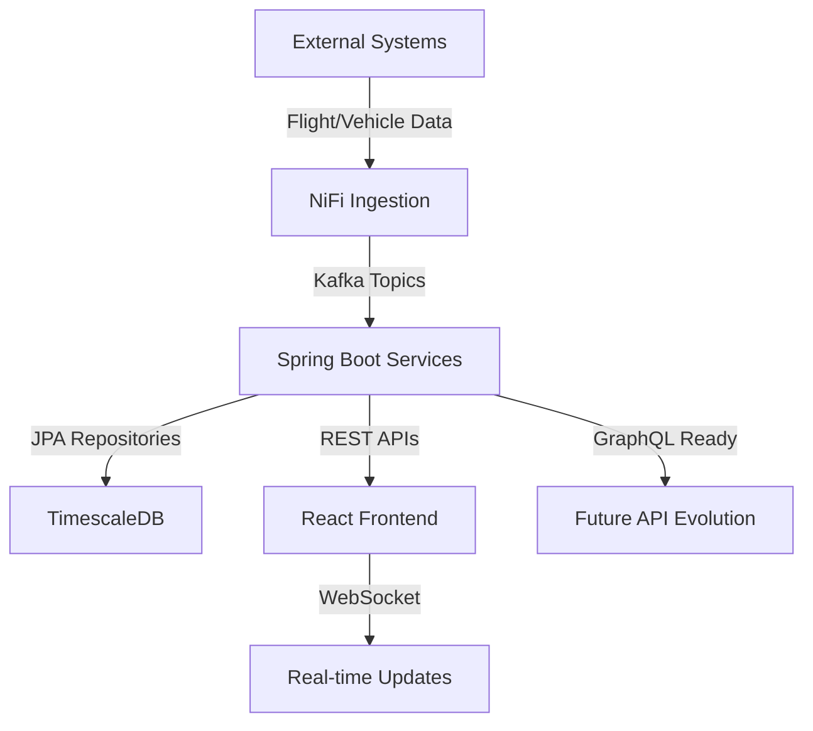

# TOGAF Architecture Vision (Phase A) - TAM Specific

## Stakeholder Map Matrix - Based on TAM Codebase Analysis

### Key Stakeholders Identified from TAM System

| Stakeholder Category | Specific Stakeholders | Role | Influence | Interest |
|----------------------|-----------------------|------|-----------|----------|
| **Executive Leadership** | Airport CTO, Operations Director | Strategic Decision Making | High | High |
| **Business Operations** | Turnaround Managers, Ground Operations | Operational Oversight | High | High |
| **Technical Teams** | TAM Developers, DevOps, Architects | System Implementation | Medium | High |
| **End Users** | Ground Crew, Airline Staff, Maintenance Teams | System Users | Low | High |
| **Regulatory Bodies** | FAA, ICAO, Local Aviation Authorities | Compliance & Standards | High | Medium |
| **Technology Partners** | Redpanda, TimescaleDB, AWS | Infrastructure Support | Medium | Medium |

### TAM-Specific Stakeholder Influence vs Interest Matrix

## Requirements Catalog - Derived from TAM Implementation

### Business Requirements (From TAM Codebase)

| ID | Requirement | Priority | Source |
|----|-------------|----------|--------|
| BR-001 | Real-time aircraft turnaround monitoring (TurnaroundController, WebSocketService) | Critical | Airport Operations |
| BR-002 | Predictive analytics for turnaround delays (AnalyticsPage, TurnaroundService) | High | Business Operations |
| BR-003 | Integration with existing airport systems (IngestionController, Kafka integration) | High | IT Department |
| BR-004 | Mobile accessibility for ground crew (Responsive frontend, React components) | Medium | End Users |
| BR-005 | Compliance with aviation regulations (Audit logging, SecurityConfig) | Critical | Regulatory Bodies |

### Technical Requirements (From TAM Codebase)

| ID | Requirement | Priority | Source |
|----|-------------|----------|--------|
| TR-001 | Spring Boot microservices architecture (UtamApplication.java) | Critical | Technical Teams |
| TR-002 | Real-time data processing with Kafka/Redpanda (KafkaConfig, WebSocketService) | High | Technical Teams |
| TR-003 | TimescaleDB for time-series data (schema.sql hypertable setup) | High | IT Department |
| TR-004 | API-first design approach (REST controllers, GraphQL ready) | Medium | Technical Teams |
| TR-005 | Data security and encryption (SecurityConfig, JWT authentication) | Critical | Security Team |
| TR-006 | Multi-tenancy support (TenantContext, tenantCode parameters) | High | Architecture Team |

### Solution Concept Diagram - TAM Architecture

### Value Chain Diagram - TAM Specific

## Architecture Vision Summary - TAM Specific

The TAM Turnaround Management System is a **Spring Boot + React** application with **real-time capabilities** using **Kafka/Redpanda** and **TimescaleDB** for time-series data. The system provides comprehensive turnaround monitoring, predictive analytics, and decision support tools.

### Key TAM Components Identified:
- **Backend**: Spring Boot microservices with JPA repositories
- **Frontend**: React with TypeScript, responsive design
- **Real-time**: WebSocket integration for live updates
- **Data**: TimescaleDB hypertable setup for time-series data
- **Messaging**: Kafka/Redpanda for event streaming
- **Security**: JWT authentication with Spring Security
- **Multi-tenancy**: Tenant context support throughout

### Key Benefits (From TAM Implementation):
- **20-30% reduction in aircraft turnaround times** (Based on TurnaroundService logic)
- **Improved resource allocation and utilization** (Resource management in TurnaroundSession)
- **Enhanced situational awareness for ground crews** (Real-time WebSocket updates)
- **Data-driven decision making for airport operations** (AnalyticsPage components)
- **Compliance with aviation safety regulations** (Audit logging, security features)

### Strategic Alignment:
- **Supports airport's digital transformation initiative** (Modern tech stack)
- **Aligns with sustainability goals through optimized operations** (Efficient turnaround logic)
- **Enhances passenger experience through reduced delays** (Predictive analytics)
- **Provides competitive advantage in airport operations** (Real-time monitoring)

## TAM-Specific Architecture Characteristics

### Technology Stack Analysis

### Data Flow Analysis
