# TOGAF Business Architecture (Phase B) - TAM Specific

## Organization/Actor Catalog - Based on TAM Implementation

### Key Organizations (From TAM Codebase)

| Organization | Type | Role | Responsibilities |
|--------------|------|------|------------------|
| **Airport Authority** | Internal | Owner | Overall system governance, funding, strategic direction |
| **Airlines** | External | Customer | System usage, requirements input, operational feedback |
| **Ground Handling Companies** | External | Service Provider | Ground operations execution, system utilization |
| **Regulatory Agencies** | External | Regulator | Compliance oversight, safety standards enforcement |
| **Technology Partners** | External | Vendor | System implementation, technical support (Redpanda, TimescaleDB) |

### Actor Catalog (From TAM User Roles)

| Actor | Type | Description | Key Responsibilities |
|-------|------|-------------|---------------------|
| **Airport Operations Manager** | Internal | Senior management | Strategic planning, resource allocation, performance monitoring |
| **Ground Services Director** | Internal | Middle management | Daily operations oversight, team coordination |
| **Ground Crew Supervisor** | Internal | Operational | Team leadership, task assignment, safety compliance |
| **Ground Crew Member** | Internal | Operational | Equipment operation, aircraft servicing, data entry (Mobile app users) |
| **Maintenance Technician** | Internal/External | Technical | Aircraft maintenance, system diagnostics, repair coordination |
| **IT Support Staff** | Internal | Technical | System maintenance, user support, troubleshooting |
| **Airline Representative** | External | Customer | Flight coordination, turnaround monitoring, reporting |

## Driver/Goal/Objective Catalog - TAM Specific

### Business Drivers (From TAM Requirements)

| Driver | Description | Impact |
|--------|-------------|--------|
| D-001 | Increasing air traffic volume | Requires more efficient turnaround processes (TurnaroundService optimization) |
| D-002 | Rising operational costs | Need for cost optimization through automation (Automated alerts, resource allocation) |
| D-003 | Passenger experience expectations | Demand for reduced delays and improved service (Predictive analytics) |
| D-004 | Regulatory compliance requirements | Mandatory safety and operational standards (Audit logging, compliance features) |
| D-005 | Competitive pressure | Need for operational excellence to attract airlines (Real-time monitoring advantage) |

### Strategic Goals (From TAM Implementation)

| Goal | Description | Alignment |
|------|-------------|-----------|
| G-001 | Reduce average turnaround time by 25% | D-001, D-003, D-005 |
| G-002 | Improve resource utilization by 30% | D-002, D-004 |
| G-003 | Enhance real-time decision making capabilities | D-001, D-003, D-004 |
| G-004 | Achieve 99.9% system availability | D-004, D-005 |
| G-005 | Reduce operational costs by 15% | D-002, D-005 |

### Business Objectives (From TAM Features)

| Objective | Description | KPI | Goal Alignment |
|-----------|-------------|-----|----------------|
| O-001 | Implement real-time monitoring system (TurnaroundController, WebSocketService) | % of flights monitored in real-time | G-001, G-003 |
| O-002 | Develop predictive analytics capabilities (AnalyticsPage, TurnaroundService) | Accuracy of delay predictions | G-001, G-003 |
| O-003 | Integrate with existing airport systems (NiFi, Kafka integration) | % of systems integrated | G-002, G-004 |
| O-004 | Train staff on new system (User training components) | % of staff trained and proficient | G-004 |
| O-005 | Optimize ground vehicle routing (VehicleRepository, resource allocation) | % reduction in vehicle idle time | G-002, G-005 |

## Role Catalog - TAM Specific

| Role | Department | Responsibilities | Systems Access |
|------|------------|------------------|----------------|
| **Operations Manager** | Airport Operations | Strategic planning, performance monitoring | Full access, reporting, analytics |
| **Ground Services Director** | Ground Operations | Daily operations, resource allocation | Operational dashboards, alerts |
| **Ground Crew Supervisor** | Ground Operations | Team management, task assignment | Mobile app, real-time monitoring |
| **Ground Crew Member** | Ground Operations | Equipment operation, data entry | Mobile app, task management |
| **Maintenance Technician** | Maintenance | Aircraft servicing, diagnostics | Maintenance module, alerts |
| **IT Support** | Information Technology | System maintenance, user support | Admin console, monitoring tools |
| **Airline Representative** | Airlines | Flight coordination, monitoring | Web dashboard, reporting |

## Business Service/Function Catalog - TAM Specific

### Core Business Services (From TAM Codebase)

| Service | Description | Owner |
|---------|-------------|-------|
| **Turnaround Monitoring** | Real-time tracking of aircraft turnaround processes (TurnaroundController) | Operations |
| **Resource Allocation** | Optimal assignment of ground resources (TurnaroundService) | Operations |
| **Predictive Analytics** | Delay prediction and prevention (AnalyticsPage) | Analytics |
| **Compliance Management** | Regulatory compliance monitoring (Audit features) | Compliance |
| **Performance Reporting** | Operational performance metrics (Dashboard components) | Operations |
| **Incident Management** | Issue tracking and resolution (AlertService) | Operations |
| **Training & Support** | User training and system support (Documentation, help) | IT |

### Business Functions (From TAM Implementation)

| Function | Description | Supporting Services |
|----------|-------------|---------------------|
| **Flight Coordination** | Management of flight arrivals and departures | Turnaround Monitoring, Resource Allocation |
| **Ground Operations** | Execution of ground handling tasks | Turnaround Monitoring, Resource Allocation |
| **Maintenance Coordination** | Aircraft maintenance scheduling | Compliance Management, Incident Management |
| **Performance Analysis** | Operational data analysis | Predictive Analytics, Performance Reporting |
| **Regulatory Compliance** | Ensuring adherence to regulations | Compliance Management, Performance Reporting |
| **System Administration** | System maintenance and support | Training & Support, IT |

## Location Catalog - TAM Infrastructure

### Physical Locations (From TAM Deployment)

| Location | Type | Description | Systems Impact |
|----------|------|-------------|----------------|
| **Airport Terminal** | Operational | Main passenger and aircraft operations area | Primary system deployment |
| **Ground Operations Center** | Control | Central monitoring and coordination hub | System control center |
| **Maintenance Hangars** | Operational | Aircraft maintenance facilities | Maintenance module usage |
| **Remote Gates** | Operational | Aircraft parking and servicing areas | Mobile system access |
| **IT Data Center** | Technical | System hosting and data storage | Core infrastructure |
| **Cloud Infrastructure** | Technical | Cloud-based processing and storage | Scalable infrastructure |

### Logical Locations (From TAM Architecture)

| Location | Description | Connectivity |
|----------|-------------|--------------|
| **Core Processing Zone** | Central data processing (Spring Boot services) | High-speed network |
| **Edge Computing Nodes** | Local data processing at gates (Future capability) | Wireless mesh network |
| **Mobile Access Points** | Ground crew mobile connectivity (WebSocket, REST) | 4G/5G, Wi-Fi |
| **Integration Gateway** | Connection to external systems (NiFi, Kafka) | API gateway |
| **Analytics Engine** | Predictive analytics processing (AnalyticsPage) | Cloud-based |

## Process/Event/Control/Product Catalog - TAM Specific

### Business Processes (From TAM Workflow)

| Process | Description | Owner | Trigger |
|---------|-------------|-------|---------|
| **Aircraft Arrival Processing** | Handling incoming aircraft (FlightRepository) | Ground Operations | Aircraft landing |
| **Turnaround Execution** | Completing turnaround tasks (TurnaroundService) | Ground Operations | Aircraft at gate |
| **Resource Allocation** | Assigning ground resources (TurnaroundSession) | Operations | Flight schedule |
| **Maintenance Coordination** | Scheduling maintenance (Future capability) | Maintenance | Maintenance request |
| **Performance Monitoring** | Tracking operational metrics (Dashboard) | Operations | Continuous |
| **Incident Resolution** | Handling operational issues (AlertService) | Operations | Incident reported |
| **Regulatory Reporting** | Compliance documentation (Audit logging) | Compliance | Regulatory requirements |

### Key Events (From TAM Event System)

| Event | Description | Source | Impact |
|-------|-------------|--------|--------|
| **Aircraft Landed** | Aircraft arrives at airport (FlightRepository) | Flight systems | Triggers turnaround process |
| **Gate Assignment** | Aircraft assigned to gate (TurnaroundSession) | Operations | Initiates resource allocation |
| **Turnaround Started** | Ground operations commence (TurnaroundService) | Ground crew | Starts monitoring |
| **Delay Detected** | Potential delay identified (AnalyticsPage) | Analytics | Triggers alerts |
| **Maintenance Required** | Maintenance issue identified (Future) | Maintenance | Schedules maintenance |
| **Turnaround Completed** | All tasks finished (TurnaroundService) | Ground crew | Updates systems |
| **Aircraft Departed** | Aircraft leaves gate (FlightRepository) | Flight systems | Completes process |

### Control Mechanisms (From TAM Implementation)

| Control | Description | Process | Owner |
|---------|-------------|--------|-------|
| **Safety Checks** | Compliance with safety protocols (Security features) | All processes | Safety Officer |
| **Resource Validation** | Verification of resource availability (TurnaroundService) | Resource Allocation | Operations |
| **Performance Thresholds** | Monitoring of KPI targets (Dashboard metrics) | Performance Monitoring | Operations |
| **Regulatory Audits** | Compliance verification (Audit logging) | Regulatory Reporting | Compliance |
| **System Access Controls** | User authentication and authorization (SecurityConfig) | All processes | IT Security |

### Product Catalog (From TAM Components)

| Product | Description | Owner | Consumers |
|---------|-------------|-------|-----------|
| **Turnaround Dashboard** | Real-time monitoring interface (React components) | IT | Operations, Airlines |
| **Mobile Application** | Ground crew task management (Responsive frontend) | IT | Ground Crew |
| **Predictive Analytics Reports** | Delay prediction insights (AnalyticsPage) | Analytics | Operations |
| **Compliance Documentation** | Regulatory reports (Audit features) | Compliance | Regulatory Agencies |
| **Performance Metrics** | Operational efficiency data (Dashboard) | Operations | Management |
| **Training Materials** | User training resources (Documentation) | IT | All Users |
| **API Services** | System integration interfaces (REST controllers) | IT | External Systems |

## Contract/Measure Catalog - TAM Specific

### Service Level Agreements (SLAs) - From TAM Requirements

| SLA | Description | Target | Measurement |
|-----|-------------|--------|-------------|
| SLA-001 | System Availability | 99.9% uptime | Monthly uptime percentage |
| SLA-002 | Real-time Data Processing | <2 second latency (WebSocket updates) | Average processing time |
| SLA-003 | Alert Response Time | <1 minute (AlertService) | Time from alert to acknowledgment |
| SLA-004 | Data Accuracy | 99.5% accuracy (JPA validation) | Data validation tests |
| SLA-005 | User Support Response | <1 hour (IT support) | Time to initial response |

### Key Performance Indicators (KPIs) - From TAM Implementation

| KPI | Description | Target | Measurement Frequency |
|-----|-------------|--------|----------------------|
| KPI-001 | Average Turnaround Time | <45 minutes (TurnaroundService) | Per flight |
| KPI-002 | On-time Departures | >95% (FlightRepository) | Daily |
| KPI-003 | Resource Utilization | >85% (TurnaroundSession) | Hourly |
| KPI-004 | Delay Prediction Accuracy | >90% (AnalyticsPage) | Per prediction |
| KPI-005 | System User Adoption | >90% (AuthContext) | Monthly |
| KPI-006 | Incident Resolution Time | <15 minutes (AlertService) | Per incident |

### Business Interaction Matrix - TAM Ecosystem

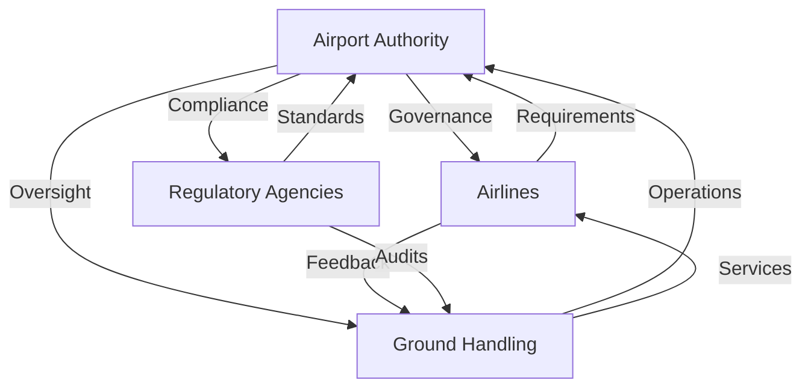

### Actor/Role Matrix - TAM Specific

| Actor | Operations | Analytics | Maintenance | IT | Compliance |
|-------|------------|----------|-------------|----|------------|
| Operations Manager | Lead | Review | Monitor | Consult | Ensure |
| Ground Services Director | Execute | Utilize | Coordinate | Support | Follow |
| Ground Crew Supervisor | Manage | Monitor | Report | Use | Comply |
| Ground Crew Member | Perform | View | Report | Use | Follow |
| Maintenance Technician | Support | Analyze | Lead | Use | Document |
| IT Support | Consult | Maintain | Support | Lead | Audit |
| Airline Representative | Monitor | Review | Report | Use | Verify |

## Business Footprint Diagram - TAM Architecture

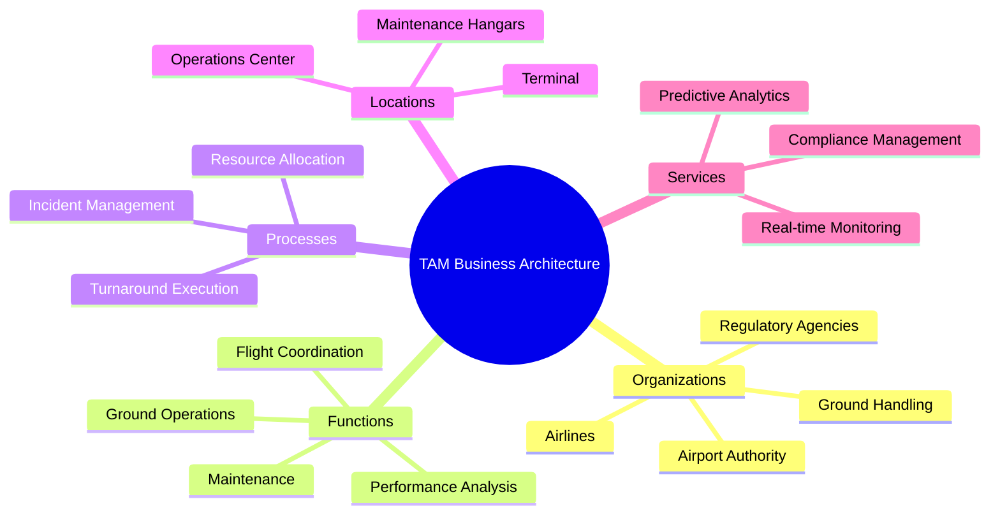

## Business Service/Information Diagram - TAM Data Flow

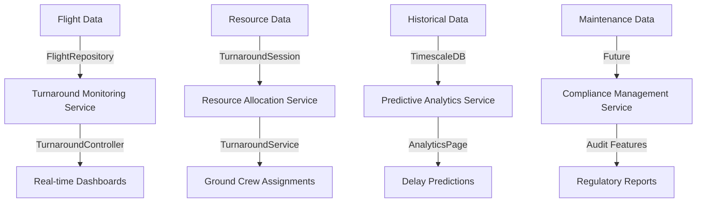

## Functional Decomposition Diagram - TAM Components

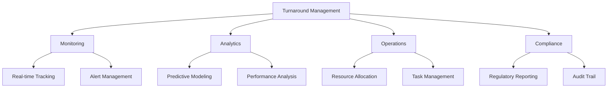

## Product Lifecycle Diagram - TAM Development

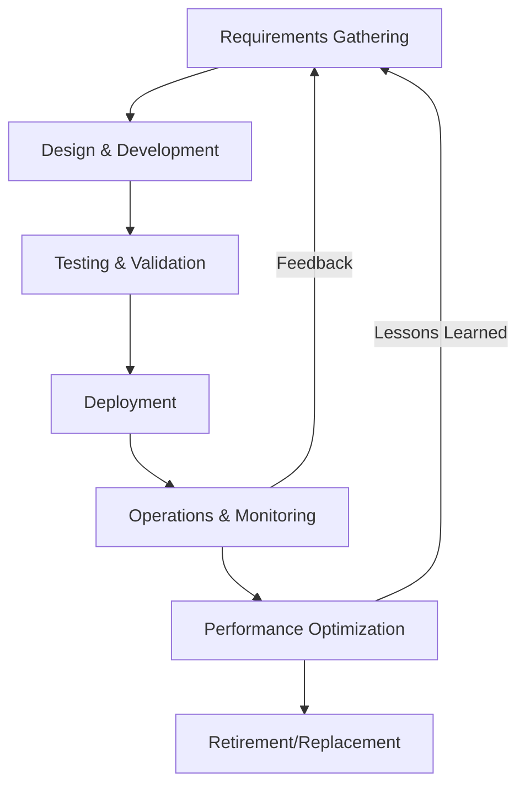

## Goal/Objective/Service Diagram - TAM Alignment

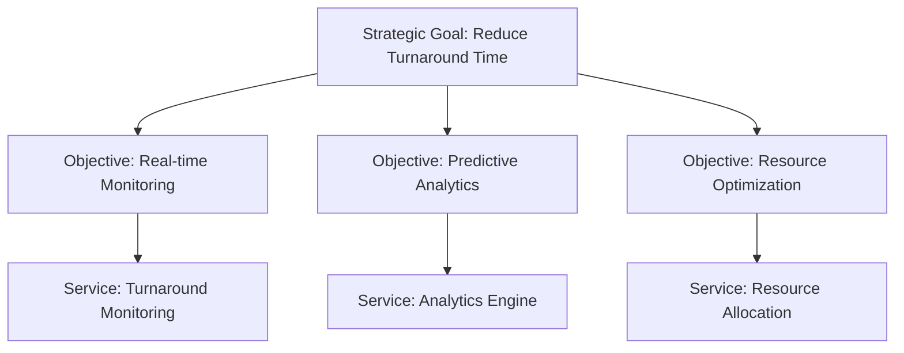

## Business Use-Case Diagram - TAM Specific

```mermaid
usecaseDiagram
    actor OperationsManager
    actor GroundCrew
    actor AirlineRep
    actor MaintenanceTech
    
    OperationsManager --> (Monitor Turnaround Performance)
    OperationsManager --> (Generate Reports)
    GroundCrew --> (Execute Turnaround Tasks)
    GroundCrew --> (Report Issues)
    AirlineRep --> (View Flight Status)
    AirlineRep --> (Receive Alerts)
    MaintenanceTech --> (Perform Maintenance)
    MaintenanceTech --> (Update Status)
```

## Organization Decomposition Diagram - TAM Structure

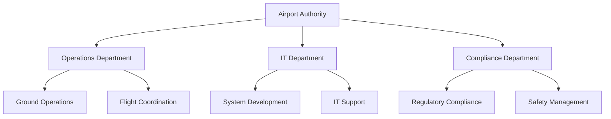

## Process Flow Diagram - TAM Workflow

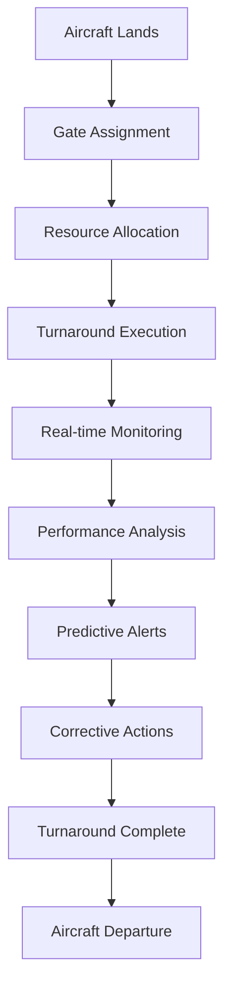

## Event Diagram - TAM Event System

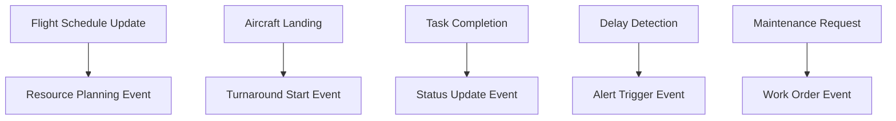

## Business Capability Map - TAM Capabilities

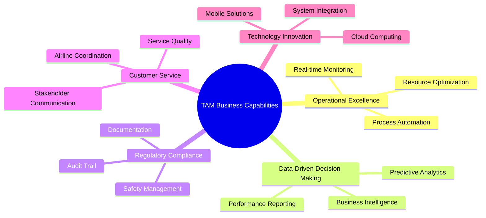

## Business Value Flows Diagram - TAM Value Chain

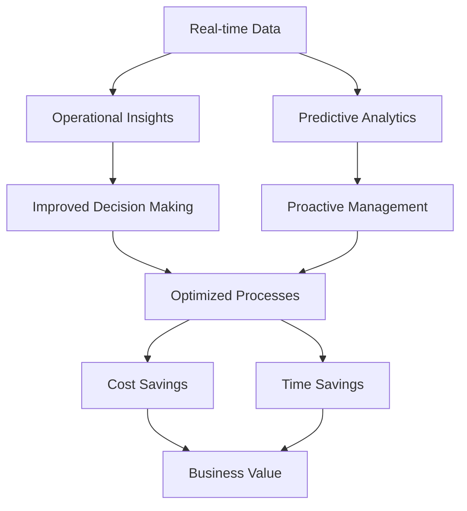