# TOGAF Information Systems Architecture - Data (Phase C) - TAM Specific

## Data Entity/Data Component Catalog - From TAM Schema

### Core Data Entities (From schema.sql)

| Entity | Description | Business Function | Data Type |
|--------|-------------|-------------------|-----------|
| **flights** | Aircraft flight information with real-time tracking | Flight Coordination | Hypertable (TimescaleDB) |
| **vehicles** | Ground vehicle information and tracking | Ground Operations | Hypertable (TimescaleDB) |
| **alerts** | System alerts and notifications | Monitoring | Hypertable (TimescaleDB) |
| **turnaround_events** | Turnaround process events | Ground Operations | Hypertable (TimescaleDB) |
| **turnarounds** | Turnaround session management | Turnaround Management | Hypertable (TimescaleDB) |
| **turnaround_activities** | Individual turnaround tasks | Task Management | Transactional |
| **stands** | Airport stand information | Resource Management | Master Data |
| **turnaround_alerts** | Turnaround-specific alerts | Monitoring | Transactional |

### Data Components (From TAM Implementation)

| Component | Description | Data Entities | Owner |
|-----------|-------------|---------------|-------|
| **Flight Management** | Flight scheduling and tracking | flights | Operations |
| **Turnaround Management** | Turnaround process tracking | turnarounds, turnaround_activities | Operations |
| **Resource Management** | Resource allocation and tracking | stands, vehicles | Operations |
| **Monitoring System** | Real-time data collection | alerts, turnaround_alerts | IT |
| **Analytics Engine** | Data analysis and predictions | flights, turnarounds (historical) | Analytics |
| **Maintenance System** | Maintenance tracking | Future capability | Maintenance |
| **User Management** | User authentication and authorization | Future capability | IT |
| **Location Services** | Airport layout and navigation | stands | Operations |

## Data Entity/Business Function Matrix - TAM Specific

| Data Entity | Flight Coordination | Ground Operations | Maintenance | Analytics | Compliance |
|-------------|--------------------|-------------------|-------------|----------|------------|
| flights | ✓ (Primary) | ✓ (Reference) | ✓ (Reference) | ✓ (Primary) | ✓ (Reference) |
| vehicles | ✓ (Reference) | ✓ (Primary) | ✓ (Reference) | ✓ (Primary) | ✓ (Reference) |
| turnarounds | ✓ (Reference) | ✓ (Primary) | ✓ (Reference) | ✓ (Primary) | ✓ (Reference) |
| turnaround_activities | ✓ (Reference) | ✓ (Primary) | ✓ (Reference) | ✓ (Primary) | ✓ (Reference) |
| stands | ✓ (Primary) | ✓ (Primary) | ✓ (Reference) | ✓ (Reference) | ✓ (Reference) |
| alerts | ✓ (Reference) | ✓ (Primary) | ✓ (Primary) | ✓ (Primary) | ✓ (Primary) |
| turnaround_alerts | ✓ (Reference) | ✓ (Primary) | ✓ (Primary) | ✓ (Primary) | ✓ (Primary) |
| turnaround_events | ✓ (Reference) | ✓ (Primary) | ✓ (Reference) | ✓ (Primary) | ✓ (Reference) |

## Application/Data Matrix - TAM Specific

| Application | flights | vehicles | turnarounds | turnaround_activities | stands | alerts | turnaround_alerts | turnaround_events |
|-------------|--------|----------|------------|----------------------|--------|-------|-------------------|------------------|
| **Flight Management System** | ✓ (R/W) | ✓ (R) | ✓ (R) | ✓ (R) | ✓ (R) | ✓ (R) | ✓ (R) | ✓ (R) |
| **Turnaround Management System** | ✓ (R) | ✓ (R) | ✓ (R/W) | ✓ (R/W) | ✓ (R/W) | ✓ (R) | ✓ (R/W) | ✓ (R/W) |
| **Resource Management System** | ✓ (R) | ✓ (R) | ✓ (R) | ✓ (R) | ✓ (R/W) | ✓ (R) | ✓ (R) | ✓ (R) |
| **Monitoring System** | ✓ (R) | ✓ (R) | ✓ (R) | ✓ (R) | ✓ (R) | ✓ (R/W) | ✓ (R/W) | ✓ (R/W) |
| **Analytics Engine** | ✓ (R) | ✓ (R) | ✓ (R) | ✓ (R) | ✓ (R) | ✓ (R) | ✓ (R) | ✓ (R) |
| **Mobile Application** | ✓ (R) | ✓ (R) | ✓ (R) | ✓ (R) | ✓ (R) | ✓ (R) | ✓ (R) | ✓ (R) |
| **Web Dashboard** | ✓ (R) | ✓ (R) | ✓ (R) | ✓ (R) | ✓ (R) | ✓ (R) | ✓ (R) | ✓ (R) |

## Logical Data Diagram - TAM Database Schema

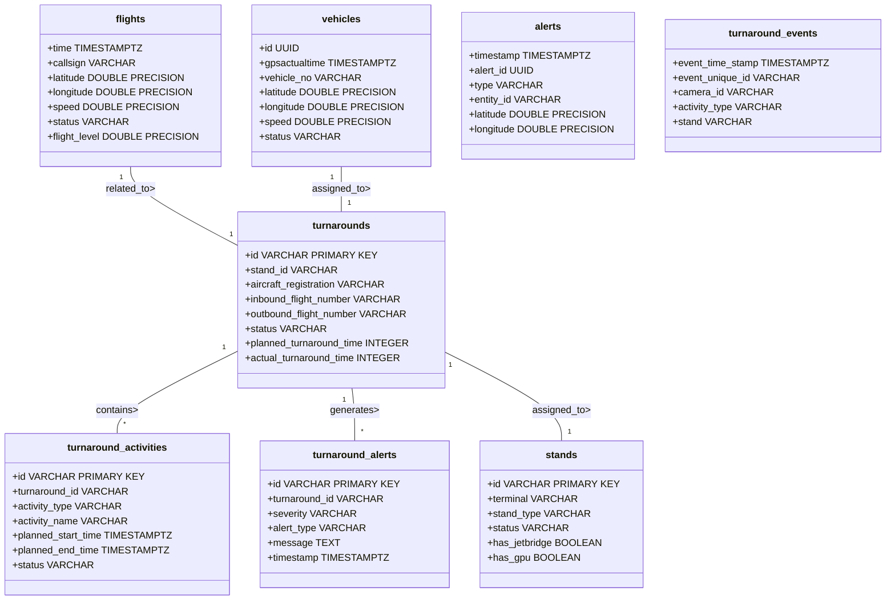

## Data Dissemination Diagram - TAM Data Flow

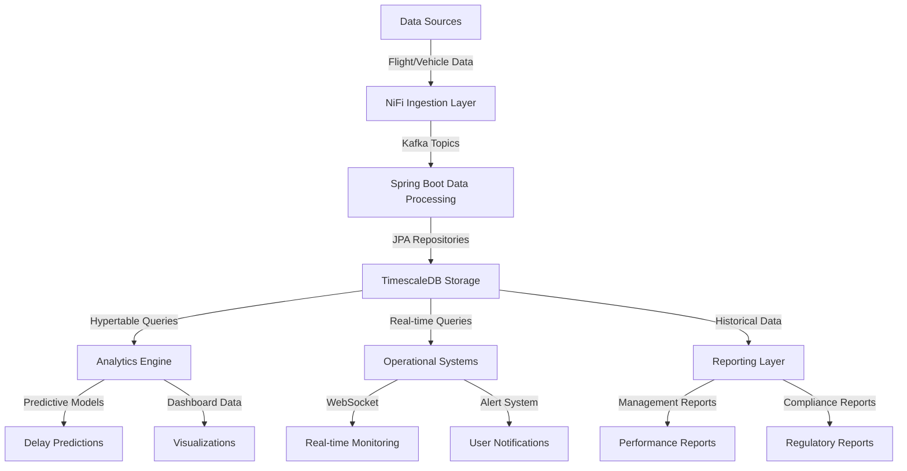

## Data Security Diagram - TAM Implementation

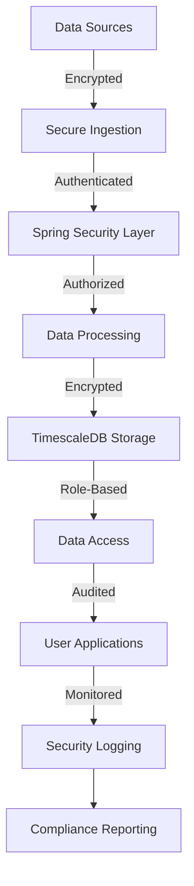

## Class Diagram - TAM Domain Model

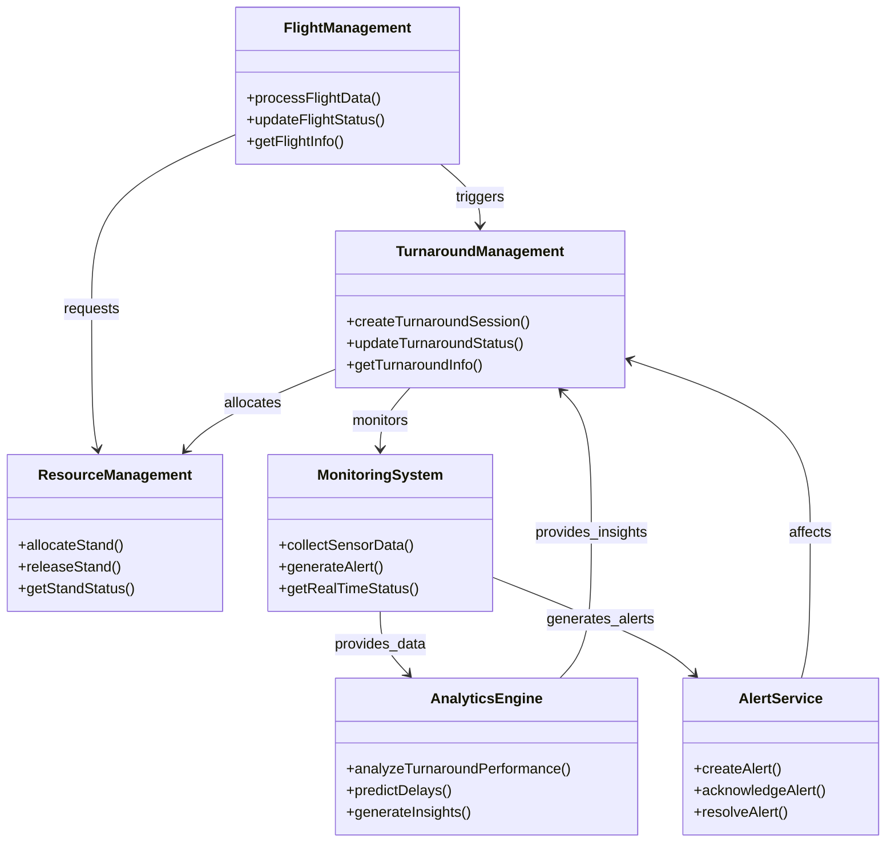

## Class Hierarchy Diagram - TAM Entity Relationships

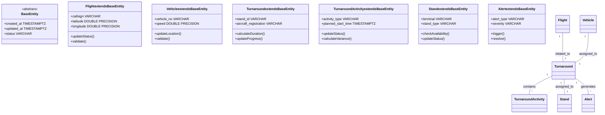

## Data Migration Diagram - TAM Implementation

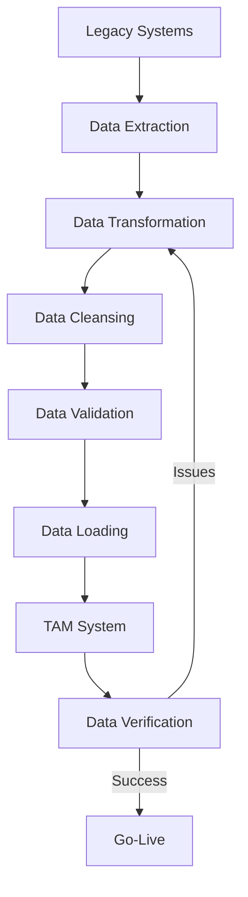

## Data Lifecycle Diagram - TAM Data Management

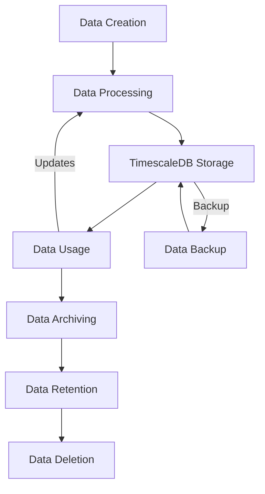

## Conceptual Data Diagram - TAM Data Model

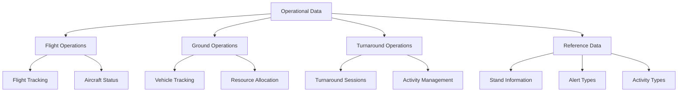

## Solution Data Flow Diagram - TAM Architecture

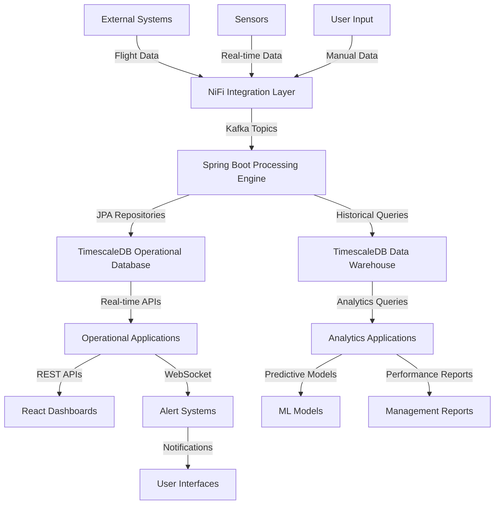

## TimescaleDB Hypertable Architecture

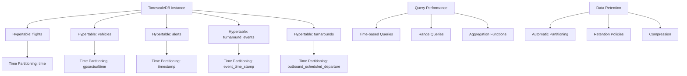

## Kafka Data Flow Diagram - TAM Event Streaming

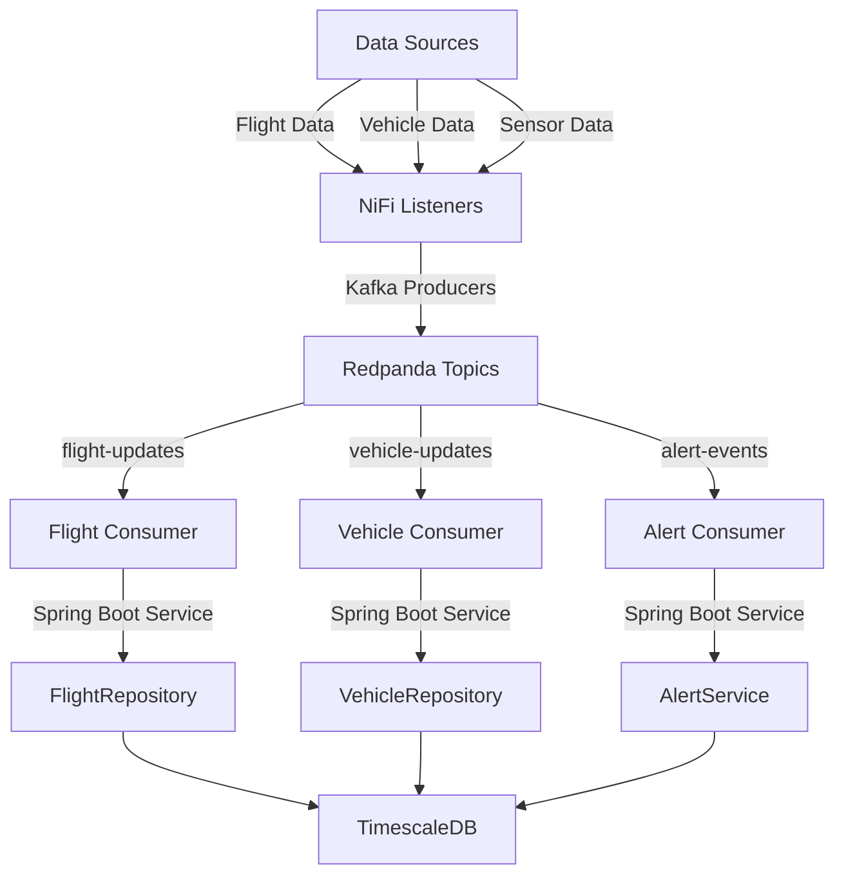