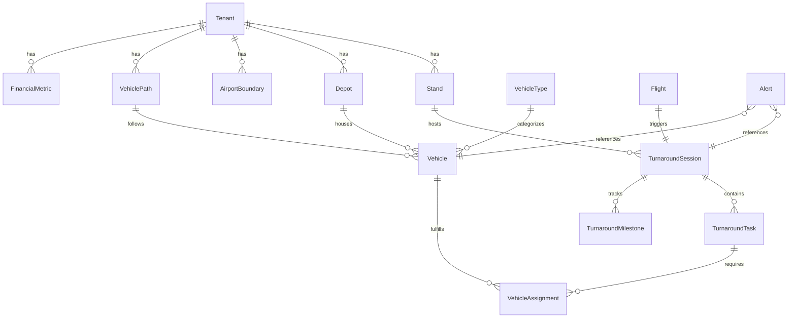

# Data Model: Entity Data Generators

**Feature**: 006-entity-data-generators | **Date**: 2026-02-03

## Entity Overview

This document defines all entities required for comprehensive data generation, including new entities and enhancements to existing ones.

---

## New Entities

### 1. Stand

Represents an aircraft parking position at an airport terminal.

```java
@Entity
@Table(name = "stands")
public class Stand {
    @Id
    @GeneratedValue(strategy = GenerationType.IDENTITY)
    private Long id;
    
    @Column(nullable = false, length = 10)
    private String tenantCode;  // VIDP, YBBN
    
    @Column(nullable = false, length = 10)
    private String standId;     // "A1", "B12", "T3-25"
    
    @Column(nullable = false, length = 100)
    private String name;        // "Terminal 3 Stand 25"
    
    @Column(columnDefinition = "geometry(Point, 4326)")
    private Point location;     // PostGIS point
    
    @Column(length = 10)
    private String terminalId;  // "T1", "T2", "T3"
    
    @Column(length = 20)
    private String standType;   // "CONTACT", "REMOTE"
    
    @Column(nullable = false)
    private Boolean active = true;
    
    private LocalDateTime createdAt;
    private LocalDateTime updatedAt;
}
```

**Indexes**: `(tenantCode, standId)` UNIQUE, `(tenantCode, terminalId)`

---

### 2. Depot

Represents a GSE vehicle storage/dispatch location.

```java
@Entity
@Table(name = "depots")
public class Depot {
    @Id
    @GeneratedValue(strategy = GenerationType.IDENTITY)
    private Long id;
    
    @Column(nullable = false, length = 10)
    private String tenantCode;
    
    @Column(nullable = false, length = 20)
    private String depotType;   // "BAGGAGE", "FUEL", "CATERING", "MAINTENANCE"
    
    @Column(nullable = false, length = 100)
    private String name;        // "Fuel Farm A"
    
    @Column(columnDefinition = "geometry(Point, 4326)")
    private Point location;
    
    @Column(nullable = false)
    private Integer capacity;   // Max vehicles
    
    @Column(nullable = false)
    private Boolean active = true;
    
    private LocalDateTime createdAt;
}
```

**Indexes**: `(tenantCode, depotType)`

---

### 3. VehicleType

Defines GSE vehicle categories with operational parameters.

```java
@Entity
@Table(name = "vehicle_types")
public class VehicleType {
    @Id
    @GeneratedValue(strategy = GenerationType.IDENTITY)
    private Long id;
    
    @Column(nullable = false, unique = true, length = 10)
    private String code;        // "BGT", "FBW", "PBT"
    
    @Column(nullable = false, length = 100)
    private String name;        // "Baggage Tractor"
    
    @Column(length = 500)
    private String description;
    
    @Column(nullable = false)
    private Integer minSpeed;   // km/h
    
    @Column(nullable = false)
    private Integer maxSpeed;   // km/h
    
    @Column(nullable = false)
    private Integer defaultQuantity;  // Per airport
    
    @ManyToOne
    @JoinColumn(name = "default_depot_type")
    private String defaultDepotType;  // Where this type parks
    
    @Column(length = 50)
    private String iconName;    // For UI display
    
    @Column(length = 7)
    private String iconColor;   // Hex color
}
```

**Indexes**: `(code)` UNIQUE

---

### 4. AirportBoundary

Stores airport perimeter polygons for boundary validation.

```java
@Entity
@Table(name = "airport_boundaries")
public class AirportBoundary {
    @Id
    @GeneratedValue(strategy = GenerationType.IDENTITY)
    private Long id;
    
    @Column(nullable = false, unique = true, length = 10)
    private String tenantCode;  // VIDP, YBBN
    
    @Column(nullable = false, length = 100)
    private String name;        // "Mumbai Airport Boundary"
    
    @Column(columnDefinition = "geometry(Polygon, 4326)", nullable = false)
    private Polygon boundary;
    
    @Column(columnDefinition = "jsonb")
    private String properties;  // Additional metadata
    
    private LocalDateTime createdAt;
    private LocalDateTime updatedAt;
}
```

**Indexes**: `(tenantCode)` UNIQUE, spatial index on `boundary`

---

### 5. VehiclePath

Admin-defined paths for vehicle simulation.

```java
@Entity
@Table(name = "vehicle_paths")
public class VehiclePath {
    @Id
    @GeneratedValue(strategy = GenerationType.IDENTITY)
    private Long id;
    
    @Column(nullable = false, length = 10)
    private String tenantCode;
    
    @Column(nullable = false, length = 100)
    private String name;        // "T3 Baggage Route"
    
    @Column(length = 500)
    private String description;
    
    @ManyToOne
    @JoinColumn(name = "vehicle_type_code")
    private VehicleType vehicleType;
    
    @Column(columnDefinition = "geometry(LineString, 4326)", nullable = false)
    private LineString waypoints;
    
    @Column(columnDefinition = "jsonb")
    private String schedule;    // {"startTime": "06:00", "endTime": "23:00", "interval": 300}
    
    @Column(nullable = false)
    private Boolean active = true;
    
    @Column(nullable = false)
    private Boolean loop = false;  // Whether path repeats
    
    private LocalDateTime createdAt;
    private LocalDateTime updatedAt;
    
    @Column(length = 50)
    private String createdBy;   // Admin username
}
```

**Indexes**: `(tenantCode, active)`, `(vehicleType)`

---

### 6. TurnaroundMilestone

Tracks key timestamps within a turnaround session.

```java
@Entity
@Table(name = "turnaround_milestones")
public class TurnaroundMilestone {
    @Id
    @GeneratedValue(strategy = GenerationType.IDENTITY)
    private Long id;
    
    @ManyToOne
    @JoinColumn(name = "session_id", nullable = false)
    private TurnaroundSession session;
    
    @Column(nullable = false, length = 50)
    private String milestoneType;  // "CHOCKS_ON", "DOOR_OPEN", "PAX_COMPLETE", etc.
    
    @Column(nullable = false)
    private LocalDateTime plannedTime;
    
    private LocalDateTime actualTime;
    
    @Column(nullable = false)
    private Integer sequenceOrder;  // For ordering
    
    private Integer varianceMinutes;  // actualTime - plannedTime
    
    @Column(length = 200)
    private String notes;
}
```

**Indexes**: `(session_id, milestoneType)` UNIQUE, `(session_id, sequenceOrder)`

---

### 7. VehicleAssignment

Links vehicles to turnaround tasks with timing.

```java
@Entity
@Table(name = "vehicle_assignments")
public class VehicleAssignment {
    @Id
    @GeneratedValue(strategy = GenerationType.IDENTITY)
    private Long id;
    
    @ManyToOne
    @JoinColumn(name = "task_id", nullable = false)
    private TurnaroundTask task;
    
    @ManyToOne
    @JoinColumn(name = "vehicle_id", nullable = false)
    private Vehicle vehicle;
    
    @Column(nullable = false)
    private LocalDateTime dispatchTime;   // Left depot
    
    @Column(nullable = false)
    private LocalDateTime arrivalTime;    // Arrived at stand
    
    private LocalDateTime startTime;      // Started task
    
    private LocalDateTime endTime;        // Completed task
    
    private LocalDateTime departureTime;  // Left stand
    
    @Column(length = 20)
    private String status;  // "DISPATCHED", "EN_ROUTE", "ON_STAND", "WORKING", "COMPLETE"
    
    @Column
    private Double distanceKm;  // Travel distance
    
    @Column
    private Integer travelTimeSeconds;
}
```

**Indexes**: `(task_id)`, `(vehicle_id, status)`, `(arrivalTime)`

---

### 8. FinancialMetric

Aggregated financial impact data per tenant per day.

```java
@Entity
@Table(name = "financial_metrics")
public class FinancialMetric {
    @Id
    @GeneratedValue(strategy = GenerationType.IDENTITY)
    private Long id;
    
    @Column(nullable = false, length = 10)
    private String tenantCode;
    
    @Column(nullable = false)
    private LocalDate metricDate;
    
    @Column(nullable = false, precision = 12, scale = 2)
    private BigDecimal totalDelayCost;      // Sum of delay costs
    
    @Column(precision = 12, scale = 2)
    private BigDecimal preventedDelayCost;  // Optimization savings
    
    @Column(precision = 12, scale = 2)
    private BigDecimal capacityGainValue;   // Additional slot revenue
    
    @Column
    private Integer totalDelayMinutes;
    
    @Column
    private Integer preventedDelayMinutes;
    
    @Column
    private Integer turnaroundsCompleted;
    
    @Column
    private Integer turnaroundsDelayed;
    
    @Column
    private Integer alertsGenerated;
    
    @Column
    private Integer alertsResolved;
    
    private LocalDateTime createdAt;
    private LocalDateTime updatedAt;
}
```

**Indexes**: `(tenantCode, metricDate)` UNIQUE

---

## Enhanced Entities

### Vehicle (existing, enhanced)

Add fields for GSE simulation:

```java
// Add to existing Vehicle entity
@ManyToOne
@JoinColumn(name = "vehicle_type_code")
private VehicleType vehicleType;

@ManyToOne
@JoinColumn(name = "depot_id")
private Depot homeDepot;

@Column(length = 20)
private String operationalStatus;  // "AVAILABLE", "ASSIGNED", "MAINTENANCE"

@ManyToOne
@JoinColumn(name = "current_path_id")
private VehiclePath currentPath;

@Column
private Integer currentWaypointIndex;
```

---

### TurnaroundTask (existing, enhanced)

Add fields for Deep Turnaround:

```java
// Add to existing TurnaroundTask entity
@Column(length = 10)
private String taskCode;  // "BGO_FWD", "CAT_UPL", "FUEL"

@Column
private Integer sequenceOrder;  // Order within turnaround

@Column
private Integer plannedDurationMinutes;

@Column
private Integer actualDurationMinutes;

@Column(columnDefinition = "jsonb")
private String dependencies;  // ["CHOCKS_ON", "DOOR_OPEN"]

@OneToMany(mappedBy = "task")
private List<VehicleAssignment> vehicleAssignments;
```

---

### Alert (existing, enhanced)

Add financial impact fields:

```java
// Add to existing Alert entity
@Column(precision = 10, scale = 2)
private BigDecimal financialImpact;  // Dollar value

@Column(length = 20)
private String impactCategory;  // "DELAY", "SAFETY", "COMPLIANCE", "EQUIPMENT"

@Column(precision = 8, scale = 2)
private BigDecimal cascadeMultiplier;  // For network effects

@Column
private Integer estimatedDelayMinutes;

@Column(columnDefinition = "jsonb")
private String recommendations;  // Action recommendations
```

---

## Entity Relationship Diagram



---

## Indexes and Constraints

### Performance Indexes

| Table | Index | Purpose |
|-------|-------|---------|
| vehicle_assignments | (vehicle_id, status) | Find available vehicles |
| turnaround_milestones | (session_id, sequence_order) | Ordered milestone retrieval |
| vehicle_paths | (tenant_code, active) | Active paths per tenant |
| financial_metrics | (tenant_code, metric_date DESC) | Recent metrics |
| stands | (tenant_code, terminal_id) | Terminal lookups |

### Spatial Indexes

| Table | Column | Type |
|-------|--------|------|
| stands | location | GIST |
| depots | location | GIST |
| airport_boundaries | boundary | GIST |
| vehicle_paths | waypoints | GIST |

### Foreign Key Constraints

All relationships use ON DELETE CASCADE for child records within a tenant scope.

---

## Data Retention

Per FR-075:
- **Retention period**: 90 days rolling (configurable via `simulation.retention.days`)
- **Affected tables**: 
  - vehicle_assignments (based on dispatchTime)
  - turnaround_milestones (based on session.startTime)
  - financial_metrics (based on metricDate)
  - asset_movement_trails (based on recordedAt)
- **Cleanup**: Scheduled job runs nightly at 03:00 UTC
