# Implementation Plan: Entity Data Generators

**Branch**: `006-entity-data-generators` | **Date**: 2026-02-03 | **Spec**: [spec.md](spec.md)
**Input**: Feature specification from `/specs/006-entity-data-generators/spec.md`

## Summary

Create comprehensive data generators for all 24 entity types to populate the TAM application with realistic simulation data. This includes:
- **Flight generators** with realistic arrival/departure patterns correlated to turnarounds
- **Vehicle generators** with 15+ GSE types following proximity-based assignments
- **Turnaround generators** with 30+ sub-processes, milestones, and vehicle correlations
- **Alert generators** with 12 types including financial impact calculations
- **Admin tools** for path drawing and GeoJSON zone editing
- **Observability** with logging, metrics, and health endpoints

## Technical Context

**Language/Version**: Java 21+ (Spring Boot 3.x), TypeScript (React 18+)
**Primary Dependencies**: Spring Boot, Spring Scheduling, Micrometer, Leaflet/MapLibre, PostGIS
**Storage**: PostgreSQL 16+ with TimescaleDB, PostGIS for spatial data
**Testing**: JUnit 5, Mockito, Vitest for frontend
**Target Platform**: Docker containers (local dev via docker-compose)
**Project Type**: Web application (backend + frontend)
**Performance Goals**: 5 position updates/sec, 50+ alerts/hour, 120s initial population
**Constraints**: 90 days data retention (configurable), ADMIN role for admin screens
**Scale/Scope**: 150+ vehicles, 50+ assets, 20+ turnarounds, 5000+ trail records per tenant

## Constitution Check

*GATE: Must pass before Phase 0 research. Re-check after Phase 1 design.*

| Principle | Status | Notes |
|-----------|--------|-------|
| I. Simplicity First | ✅ PASS | Generators follow existing Mock*Generator patterns |
| II. Containerization | ✅ PASS | All generators run in existing Spring Boot container |
| III. Simulation Driven | ✅ PASS | This feature IS the simulation layer enhancement |
| IV. Tech Stack Compliance | ✅ PASS | Spring Boot 3.x, React 18+, PostgreSQL 16+, Kafka |
| V. Documentation | ✅ PASS | Spec fully documented with 83 requirements |

**Gate Result**: PASS - No violations requiring justification.

## Project Structure

### Documentation (this feature)

```text
specs/006-entity-data-generators/
├── plan.md              # This file
├── research.md          # Phase 0 output
├── data-model.md        # Phase 1 output
├── quickstart.md        # Phase 1 output
├── contracts/           # Phase 1 output (API contracts)
└── tasks.md             # Phase 2 output
```

### Source Code (repository root)

```text
backend/
├── src/main/java/com/utam/
│   ├── simulation/                    # Data generators (ENHANCED)
│   │   ├── config/
│   │   │   └── SimulationConfig.java          # Central config with retention, rates
│   │   ├── core/
│   │   │   ├── BaseDataGenerator.java         # Abstract base with common logic
│   │   │   └── GeneratorOrchestrator.java     # Coordinates all generators
│   │   ├── flight/
│   │   │   ├── FlightDataGenerator.java       # Arrivals/departures
│   │   │   └── FlightTrajectoryCalculator.java
│   │   ├── vehicle/
│   │   │   ├── VehicleDataGenerator.java      # GSE fleet
│   │   │   ├── VehiclePathPlayer.java         # Follows defined paths
│   │   │   └── ProximityAssignmentService.java
│   │   ├── turnaround/
│   │   │   ├── TurnaroundDataGenerator.java   # Sessions, tasks, milestones
│   │   │   └── TurnaroundCorrelator.java      # Links flights, vehicles
│   │   ├── alert/
│   │   │   ├── AlertDataGenerator.java        # 12 alert types
│   │   │   └── FinancialImpactCalculator.java
│   │   ├── security/
│   │   │   ├── ZoneDataGenerator.java         # Restricted zones
│   │   │   └── ViolationDataGenerator.java
│   │   ├── tracking/
│   │   │   ├── MovementTrailGenerator.java    # Historical trails
│   │   │   └── LocationRegisterUpdater.java
│   │   └── retention/
│   │       └── DataRetentionService.java      # 90-day cleanup
│   ├── admin/
│   │   ├── controller/
│   │   │   ├── PathEditorController.java      # REST API for paths
│   │   │   └── ZoneEditorController.java      # REST API for zones
│   │   ├── dto/
│   │   │   ├── VehiclePathDTO.java
│   │   │   └── ZoneDTO.java
│   │   └── service/
│   │       ├── VehiclePathService.java
│   │       └── ZoneService.java
│   └── monitoring/
│       └── SimulationHealthIndicator.java     # Health endpoint
└── src/test/java/com/utam/simulation/
    └── [Unit and integration tests]

frontend/
├── src/
│   ├── pages/
│   │   ├── admin/
│   │   │   ├── DataGeneratorAdminPage.tsx     # Main admin dashboard
│   │   │   ├── PathEditorPage.tsx             # Vehicle path drawing
│   │   │   └── ZoneEditorPage.tsx             # GeoJSON zone editor
│   ├── components/
│   │   ├── admin/
│   │   │   ├── PathDrawingMap.tsx             # Leaflet path drawing
│   │   │   ├── ZoneEditorMap.tsx              # GeoJSON polygon editor
│   │   │   ├── PathPreview.tsx                # Animated path preview
│   │   │   └── GeneratorControls.tsx          # Start/stop/config UI
│   │   └── shared/
│   │       └── UndoRedoProvider.tsx           # Ctrl+Z/Y support
│   └── services/
│       ├── pathApi.ts                         # Path CRUD
│       └── zoneApi.ts                         # Zone CRUD + GeoJSON import/export
└── tests/
    └── [Component and integration tests]
```

**Structure Decision**: Web application structure following existing TAM patterns. Backend generators extend existing Mock*Generator classes. Frontend admin pages added under /admin route protected by ADMIN role.

## Phase 0: Research Tasks

### Research Areas

| # | Topic | Purpose |
|---|-------|---------|
| R1 | Airport Boundary Data | Source GeoJSON polygons for VIDP, YBBN perimeters |
| R2 | Stand/Depot Coordinates | Define stand positions and GSE depot locations |
| R3 | Turnaround Sub-Processes | Document all 30+ Deep Turnaround activities |
| R4 | GSE Fleet Quantities | Validate realistic fleet sizes per airport |
| R5 | Alert Financial Rates | Confirm $100-150/min and slot values by time |
| R6 | Leaflet Drawing Plugins | Evaluate leaflet-draw vs leaflet-geoman |

### Research Output

Findings will be consolidated in `research.md` with:
- Decision: [what was chosen]
- Rationale: [why chosen]
- Alternatives considered: [what else evaluated]

## Phase 1: Design Artifacts

### 1.1 Data Model (data-model.md)

New/enhanced entities:

| Entity | Fields | Relationships |
|--------|--------|---------------|
| VehiclePath | id, name, tenantCode, vehicleType, waypoints (JSON), schedule | → VehicleType |
| AirportBoundary | id, tenantCode, boundary (Polygon), createdAt | → Tenant |
| Stand | id, tenantCode, standId, name, location (Point), terminalId | → Tenant |
| Depot | id, tenantCode, depotType, name, location (Point), capacity | → Tenant, VehicleType |
| VehicleType | id, code, name, depotId, quantity, speedRange | → Depot |
| TurnaroundMilestone | id, sessionId, milestoneType, plannedTime, actualTime | → TurnaroundSession |
| VehicleAssignment | id, taskId, vehicleId, arrivalTime, startTime, endTime, departureTime | → TurnaroundTask, Vehicle |
| FinancialMetric | id, tenantCode, date, delayCost, preventedCost, capacityGain | → Tenant |

### 1.2 API Contracts (contracts/)

| Endpoint | Method | Description |
|----------|--------|-------------|
| `/api/admin/paths` | GET, POST | List/create vehicle paths |
| `/api/admin/paths/{id}` | GET, PUT, DELETE | CRUD for single path |
| `/api/admin/paths/{id}/preview` | GET | Get animated preview data |
| `/api/admin/zones` | GET, POST | List/create restricted zones |
| `/api/admin/zones/{id}` | GET, PUT, DELETE | CRUD for single zone |
| `/api/admin/zones/import` | POST | Import GeoJSON file |
| `/api/admin/zones/export` | GET | Export zones as GeoJSON |
| `/api/admin/generators` | GET | Get generator status/health |
| `/api/admin/generators/{type}/start` | POST | Start specific generator |
| `/api/admin/generators/{type}/stop` | POST | Stop specific generator |
| `/actuator/health/simulation` | GET | Health indicator for generators |
| `/actuator/prometheus` | GET | Micrometer metrics |

### 1.3 Quickstart (quickstart.md)

```bash
# 1. Start infrastructure
cd /Users/sujoymukherjee/code/TAM
docker-compose up -d

# 2. Run initial data population
curl -X POST http://localhost:8080/api/admin/generators/batch/start

# 3. Enable continuous simulation
curl -X POST http://localhost:8080/api/admin/generators/continuous/start

# 4. Access admin tools
# Open http://localhost:3000/admin (requires ADMIN login)

# 5. Monitor metrics
curl http://localhost:8080/actuator/prometheus | grep simulator
```

## Phase 2: Implementation Phases

> **Note**: This section provides a summary. See [tasks.md](tasks.md) for the authoritative detailed breakdown (94 tasks).

### Phase 2.1: Core Infrastructure (Week 1)

| Task | Description | Files |
|------|-------------|-------|
| T001 | Create SimulationConfig with retention, rates | SimulationConfig.java |
| T002 | Create BaseDataGenerator abstract class | BaseDataGenerator.java |
| T003 | Create GeneratorOrchestrator | GeneratorOrchestrator.java |
| T004 | Add SimulationHealthIndicator | SimulationHealthIndicator.java |
| T005 | Add Micrometer metrics | All generators |
| T006 | Create DataRetentionService (90-day cleanup) | DataRetentionService.java |

### Phase 2.2: Reference Data Generators (Week 1)

| Task | Description | Files |
|------|-------------|-------|
| T007 | Create Stand entity and generator | Stand.java, StandDataGenerator.java |
| T008 | Create Depot entity and generator | Depot.java, DepotDataGenerator.java |
| T009 | Create VehicleType entity and generator | VehicleType.java, VehicleTypeDataGenerator.java |
| T010 | Create AirportBoundary entity and generator | AirportBoundary.java, BoundaryDataGenerator.java |
| T011 | Seed VIDP and YBBN reference data | data/vidp.json, data/ybbn.json |

### Phase 2.3: Flight & Turnaround Generators (Week 2)

| Task | Description | Files |
|------|-------------|-------|
| T012 | Enhance FlightDataGenerator (arrivals/departures) | FlightDataGenerator.java |
| T013 | Create FlightTrajectoryCalculator | FlightTrajectoryCalculator.java |
| T014 | Create TurnaroundDataGenerator | TurnaroundDataGenerator.java |
| T015 | Create TurnaroundMilestone entity and generator | TurnaroundMilestone.java |
| T016 | Create TurnaroundCorrelator (flight → session) | TurnaroundCorrelator.java |
| T017 | Define 30+ sub-process task types | TurnaroundTaskType.java |

### Phase 2.4: Vehicle & GSE Generators (Week 2)

| Task | Description | Files |
|------|-------------|-------|
| T018 | Enhance VehicleDataGenerator (15 GSE types) | VehicleDataGenerator.java |
| T019 | Create ProximityAssignmentService | ProximityAssignmentService.java |
| T020 | Create VehicleAssignment entity | VehicleAssignment.java |
| T021 | Create VehiclePathPlayer | VehiclePathPlayer.java |
| T022 | Implement depot → stand → next routing | VehicleRouteCalculator.java |

### Phase 2.5: Alert & Financial Generators (Week 3)

| Task | Description | Files |
|------|-------------|-------|
| T023 | Create AlertDataGenerator (12 types) | AlertDataGenerator.java |
| T024 | Create FinancialImpactCalculator | FinancialImpactCalculator.java |
| T025 | Create FinancialMetric entity | FinancialMetric.java |
| T026 | Implement network cascade detection | CascadeAnalyzer.java |
| T027 | Add alert severity and recommendations | AlertEnricher.java |

### Phase 2.6: Security & Tracking Generators (Week 3)

| Task | Description | Files |
|------|-------------|-------|
| T028 | Enhance ZoneDataGenerator | ZoneDataGenerator.java |
| T029 | Create ViolationDataGenerator | ViolationDataGenerator.java |
| T030 | Create MovementTrailGenerator | MovementTrailGenerator.java |
| T031 | Create LocationRegisterUpdater | LocationRegisterUpdater.java |
| T032 | Implement boundary validation | BoundaryValidator.java |

### Phase 2.7: Admin Backend APIs (Week 4)

| Task | Description | Files |
|------|-------------|-------|
| T033 | Create VehiclePath entity and repository | VehiclePath.java, VehiclePathRepository.java |
| T034 | Create PathEditorController | PathEditorController.java |
| T035 | Create VehiclePathService | VehiclePathService.java |
| T036 | Create ZoneEditorController | ZoneEditorController.java |
| T037 | Create ZoneService with GeoJSON import/export | ZoneService.java |
| T038 | Add ADMIN role security to admin endpoints | SecurityConfig.java |

### Phase 2.8: Admin Frontend - Path Editor (Week 4)

| Task | Description | Files |
|------|-------------|-------|
| T039 | Create PathEditorPage | PathEditorPage.tsx |
| T040 | Create PathDrawingMap with Leaflet | PathDrawingMap.tsx |
| T041 | Create PathPreview with animation | PathPreview.tsx |
| T042 | Create pathApi service | pathApi.ts |
| T043 | Add undo/redo support | UndoRedoProvider.tsx |

### Phase 2.9: Admin Frontend - Zone Editor (Week 5)

| Task | Description | Files |
|------|-------------|-------|
| T044 | Create ZoneEditorPage | ZoneEditorPage.tsx |
| T045 | Create ZoneEditorMap with polygon tools | ZoneEditorMap.tsx |
| T046 | Add zone property editor panel | ZonePropertiesPanel.tsx |
| T047 | Add GeoJSON import/export | GeoJsonImportExport.tsx |
| T048 | Create zoneApi service | zoneApi.ts |
| T049 | Add geometry validation | GeometryValidator.ts |

### Phase 2.10: Admin Frontend - Dashboard (Week 5)

| Task | Description | Files |
|------|-------------|-------|
| T050 | Create DataGeneratorAdminPage | DataGeneratorAdminPage.tsx |
| T051 | Create GeneratorControls | GeneratorControls.tsx |
| T052 | Create GeneratorStatus display | GeneratorStatus.tsx |
| T053 | Add admin route with ADMIN guard | AdminRoute.tsx |

### Phase 2.11: Testing & Integration (Week 6)

| Task | Description | Files |
|------|-------------|-------|
| T054 | Unit tests for all generators | *Test.java |
| T055 | Integration tests for correlations | TurnaroundCorrelationIT.java |
| T056 | Frontend component tests | *.test.tsx |
| T057 | E2E test for admin tools | admin.spec.ts |
| T058 | Performance test (5 updates/sec) | PerformanceTest.java |
| T059 | Data retention test | DataRetentionTest.java |

## Dependency Graph

```mermaid
graph TD
    T001[T001: SimulationConfig] --> T002[T002: BaseDataGenerator]
    T002 --> T003[T003: GeneratorOrchestrator]
    T002 --> T004[T004: HealthIndicator]
    T002 --> T005[T005: Metrics]
    T001 --> T006[T006: DataRetention]
    
    T007[T007: Stand] --> T010[T010: AirportBoundary]
    T008[T008: Depot] --> T009[T009: VehicleType]
    T011[T011: Reference Data] --> T007
    T011 --> T008
    
    T012[T012: FlightGenerator] --> T013[T013: Trajectory]
    T012 --> T016[T016: Correlator]
    T014[T014: TurnaroundGen] --> T015[T015: Milestones]
    T014 --> T016
    T014 --> T017[T017: TaskTypes]
    
    T018[T018: VehicleGen] --> T019[T019: Proximity]
    T018 --> T020[T020: Assignment]
    T018 --> T021[T021: PathPlayer]
    T019 --> T022[T022: Routing]
    
    T023[T023: AlertGen] --> T024[T024: Financial]
    T023 --> T025[T025: FinancialMetric]
    T023 --> T026[T026: Cascade]
    T023 --> T027[T027: Enricher]
    
    T028[T028: ZoneGen] --> T029[T029: Violations]
    T030[T030: TrailGen] --> T031[T031: LocationReg]
    T010 --> T032[T032: BoundaryValid]
    
    T033[T033: VehiclePath] --> T034[T034: PathController]
    T034 --> T035[T035: PathService]
    T036[T036: ZoneController] --> T037[T037: ZoneService]
    T034 --> T038[T038: Security]
    T036 --> T038
    
    T039[T039: PathEditorPage] --> T040[T040: DrawingMap]
    T039 --> T041[T041: Preview]
    T039 --> T042[T042: pathApi]
    T039 --> T043[T043: UndoRedo]
    
    T044[T044: ZoneEditorPage] --> T045[T045: ZoneMap]
    T044 --> T046[T046: PropsPanel]
    T044 --> T047[T047: GeoJSON]
    T044 --> T048[T048: zoneApi]
    T045 --> T049[T049: GeomValid]
    
    T050[T050: AdminPage] --> T051[T051: Controls]
    T050 --> T052[T052: Status]
    T050 --> T053[T053: AdminRoute]
```



## Risk Assessment

| Risk | Impact | Likelihood | Mitigation |
|------|--------|------------|------------|
| PostGIS complexity | Medium | Low | Use existing patterns from 005-asset-tracking-security |
| Leaflet-draw learning curve | Low | Medium | Use well-documented leaflet-geoman library |
| Performance at scale | Medium | Low | Batch inserts, configurable rates, 90-day retention |
| Correlation accuracy | High | Medium | Extensive integration tests for flight-vehicle-turnaround links |
| GeoJSON import edge cases | Low | Medium | Validate geometry, handle partial imports |

## Success Metrics

| Metric | Target | Measurement |
|--------|--------|-------------|
| Entity coverage | 24/24 types | Count generators |
| GSE fleet | 15 types, 150+ vehicles | Query vehicles table |
| Turnaround processes | 30+ sub-tasks | Query task types |
| Alert types | 12 types | Query distinct alert types |
| Generation rate | 5 updates/sec | Prometheus metrics |
| Retention cleanup | 90 days | Check oldest records |
| Admin path creation | <30 sec to see data | Manual test |
